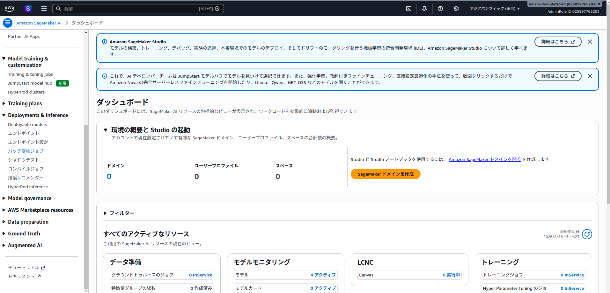

# Batch Transformを実行する

Amazon SageMaker AIのBatch Transformを使用すると、Amazon S3に保存した文書をまとめて解析できます。ジョブの実行中だけ推論用インスタンスが起動し、解析結果はJSONとしてS3に保存されます。

このページでは、YomiToku-Proのモデルを使ってBatch Transformを実行し、出力された`.out`ファイルをダウンロードするまでの手順を説明します。

!!! info "Batch Transformの出力"
    入力オブジェクトごとに、元の名前へ`.out`を付けたJSONファイルが作成されます。たとえば`document.pdf`の出力名は`document.pdf.out`です。

## 前提条件

以下を準備してください。

- AWS MarketplaceでYomiToku-Proをサブスクライブ済みであること
- サブスクライブしたモデルパッケージから作成したSageMakerモデル（未作成の場合は次の「SageMakerモデルを準備する」を参照）
- 入出力に使用するS3バケット
- SageMaker実行ロール
- AWS CLIを使う場合は、AWS CLIの認証とリージョンが設定済みであること

SageMaker実行ロールには、少なくとも入力先S3オブジェクトの読み取り権限と、出力先S3プレフィックスへの書き込み権限が必要です。S3オブジェクトをAWS KMSで暗号化している場合は、使用するKMSキーの権限も必要です。

## SageMakerモデルを準備する

Batch Transformを実行するには、サブスクライブしたYomiToku-Proのモデルパッケージから作成したSageMakerモデルが必要です。

モデルをまだ作成していない場合は、[Step 1: SageMakerモデルを作成する](deploy-yomitoku-pro.md#create-sagemaker-model)の手順で作成してください。モデルを作成したらこのページへ戻り、「1. 入力ファイルをS3にアップロードする」へ進みます。

!!! info "エンドポイントは不要です"
    Batch Transformで必要なのはSageMakerモデルです。リアルタイム推論用のエンドポイント設定とエンドポイントを作成する必要はありません。

### Model Package ARNを取得する {#get-model-package-arn}

AWS CLIでSageMakerモデルを作成するには、使用するYomiToku-Pro製品およびバージョンのModel Package ARNが必要です。通常版とLite版は別のMarketplace製品であり、ARNも異なります。通常版では通常版製品、Lite版ではLite版製品をサブスクライブして、それぞれのARNを取得してください。

#### AWSコンソールから取得する

1. Amazon SageMaker AIコンソールを開きます。
2. 左側のメニューから **AWS Marketplace resources > モデルパッケージ** を開きます。
3. **AWS Marketplaceサブスクリプション**から、使用する通常版またはLite版のYomiToku-Pro製品を開きます。Lite版を利用する場合はLite版製品のサブスクリプションを選択します。
4. 使用するバージョンを選択します。
5. 詳細画面に表示される **Model Package ARN**をコピーします。

ARNは次のような形式です。

```text
arn:aws:sagemaker:ap-northeast-1:123456789012:model-package/example
```

`yomitoku-client`をインストールしている場合は、使用する製品を`--product`で指定すると、その製品のモデルパッケージ一覧のURLを表示できます。

```bash
# 通常版
yomitoku-client sagemaker configure \
  --product document-analyzer \
  --region ap-northeast-1

# Lite版
yomitoku-client sagemaker configure \
  --product document-analyzer-lite \
  --region ap-northeast-1
```

表示されたURLを、指定した製品をサブスクライブしたAWSアカウントで開きます。使用するバージョンを選び、Model Package ARNをコピーしてターミナルへ貼り付けます。入力したARNは`~/.yomitoku/config.json`へ製品ごとに保存されます。

一覧が空の場合は、AWSアカウントとリージョンが購読時のものか確認してください。URLから確認できない場合は、Marketplaceのダッシュボードから対象製品を開いてSageMakerモデルを作成し、SageMaker AIコンソールの **Deployments & inference > モデル** にあるモデル詳細画面から **Model package name**を取得します。詳しくは[URLからModel Package ARNを取得できない場合](deploy-yomitoku-pro.md#arn-fallback)を参照してください。

!!! warning "リージョンとバージョンを確認してください"
    Model Package ARNは通常版／Lite版の製品、リージョン、ソフトウェアバージョンごとに異なります。Batch Transformジョブと同じリージョンにある、使用する製品とバージョンのARNをコピーしてください。製品ページのURLや製品ID（`prod-...`）はModel Package ARNではありません。

#### 作成済みモデルから確認する

既にYomiToku-ProのSageMakerモデルがある場合は、モデルのコンテナ定義からARNを取得できます。

```bash
aws sagemaker describe-model \
  --model-name YOUR_MODEL_NAME \
  --query 'PrimaryContainer.ModelPackageName' \
  --output text \
  --region ap-northeast-1
```

### 軽量モードを利用する {#batch-lite-model}

Lite版は通常版とは別のAWS Marketplace製品として提供されます。AWS MarketplaceでLite版製品をサブスクライブし、**AWS Marketplaceサブスクリプション**からLite版のModel Package ARNを取得してください。通常版のARNを指定したまま、環境変数やエンドポイント名でLite版へ切り替えることはできません。

Lite版モデルをAWS CLIで作成する場合は、Lite版製品のARNを`ModelPackageName`へ指定します。`Environment`は指定しません。

```bash
aws sagemaker create-model \
  --model-name yomitoku-pro-lite-batch \
  --execution-role-arn arn:aws:iam::YOUR_ACCOUNT_ID:role/YOUR_SAGEMAKER_ROLE \
  --primary-container '{"ModelPackageName":"YOUR_LITE_MODEL_PACKAGE_ARN"}' \
  --region ap-northeast-1
```

## 1. 入力ファイルをS3にアップロードする

この例では、ローカルの`input`ディレクトリにあるPDFをS3へアップロードします。

```bash
aws s3 cp ./input/ s3://YOUR_BUCKET/yomitoku-batch/input/ \
  --recursive \
  --exclude "*" \
  --include "*.pdf"
```

YomiToku-Proが受け付けるContent-Typeは次のとおりです。

| 入力形式 | Content-Type |
| --- | --- |
| PDF | `application/pdf` |
| JPEG | `image/jpeg` |
| PNG | `image/png` |
| TIFF | `image/tiff` |

!!! warning "1ジョブには同じ形式のファイルを指定してください"
    Batch Transformの`ContentType`はジョブ全体で1つです。PDFとPNGのようにContent-Typeが異なるファイルは、入力プレフィックスまたはジョブを分けてください。

!!! warning "入力プレフィックスを空にしないでください"
    `S3DataType=S3Prefix`では、指定したプレフィックス以下のオブジェクトが処理対象になります。入力プレフィックスには、処理対象以外のファイルを置かないでください。また、出力プレフィックスは入力プレフィックスの外にしてください。

## 2. Batch Transformジョブを作成する

### AWSマネジメントコンソールを使う場合

1. 入力ファイルと同じリージョンのAmazon SageMaker AIコンソールを開きます。
2. 左側のメニューから **Deployments & inference > バッチ変換ジョブ** を開きます。

3. **バッチ変換ジョブを作成** を選択します。
4. ジョブ名と、YomiToku-Proのモデル名を指定します。
5. インスタンスタイプとインスタンス数を指定します。最初の動作確認では、モデルパッケージが対応しているインスタンスタイプを1台指定してください。
6. 入力データを次のように設定します。

    | 項目 | PDFの場合の設定値 |
    | --- | --- |
    | S3データタイプ | `S3Prefix` |
    | S3の場所 | `s3://YOUR_BUCKET/yomitoku-batch/input/` |
    | Content-Type | `application/pdf` |
    | 圧縮タイプ | `None` |
    | 分割タイプ | `None` |

7. 出力データを次のように設定します。

    | 項目 | 設定値 |
    | --- | --- |
    | S3出力先 | `s3://YOUR_BUCKET/yomitoku-batch/output/` |
    | Accept | `application/json` |
    | 結合方法 | `None` |

8. ジョブを作成します。

`SplitType=None`を指定すると、S3オブジェクト全体が1回の推論リクエストとしてYomiToku-Proへ渡されます。画像やPDFのバイナリを行単位で分割しないよう、`Line`は指定しないでください。

### AWS CLIを使う場合

次の値を環境に合わせて置き換えます。

- `YOUR_MODEL_NAME`: 作成済みのSageMakerモデル名
- `YOUR_BUCKET`: 入出力用S3バケット名
- `ml.g4dn.xlarge`: 使用するモデルパッケージが対応しているインスタンスタイプ
- `ap-northeast-1`: 使用するAWSリージョン

```bash
aws sagemaker create-transform-job \
  --transform-job-name yomitoku-batch-001 \
  --model-name YOUR_MODEL_NAME \
  --transform-input 'DataSource={S3DataSource={S3DataType=S3Prefix,S3Uri=s3://YOUR_BUCKET/yomitoku-batch/input/}},ContentType=application/pdf,CompressionType=None,SplitType=None' \
  --transform-output 'S3OutputPath=s3://YOUR_BUCKET/yomitoku-batch/output/,Accept=application/json,AssembleWith=None' \
  --transform-resources 'InstanceType=ml.g4dn.xlarge,InstanceCount=1' \
  --region ap-northeast-1
```

JPEG、PNG、TIFFを処理するときは、`ContentType`を入力形式に合わせて変更してください。

!!! note "ペイロードサイズ"
    SageMaker Batch Transformの`MaxPayloadInMB`は最大100 MBです。大きなPDFを処理する場合はこの制限と処理時間に注意してください。まずは小さな画像またはPDF 1ファイルで動作を確認することを推奨します。

## 3. ジョブの状態を確認する

AWS CLIでは次のコマンドで状態を確認できます。

```bash
aws sagemaker describe-transform-job \
  --transform-job-name yomitoku-batch-001 \
  --query '{Status:TransformJobStatus,FailureReason:FailureReason}' \
  --region ap-northeast-1
```

`TransformJobStatus`が`Completed`になれば完了です。`Failed`の場合は、`FailureReason`とAmazon CloudWatch Logsの推論コンテナログを確認してください。

Batch Transformのインスタンスはジョブ完了後に終了するため、リアルタイムエンドポイントのような削除操作は不要です。ただし、S3の入力・出力オブジェクトには保存料金が発生します。

## 4. `.out`ファイルを確認・ダウンロードする {#download-batch-output}

出力先を一覧表示します。

```bash
aws s3 ls s3://YOUR_BUCKET/yomitoku-batch/output/ --recursive
```

入力が次の場所にある場合:

```text
s3://YOUR_BUCKET/yomitoku-batch/input/document.pdf
```

出力先には、入力名に`.out`が付いたオブジェクトが作成されます。入力プレフィックス以下にサブディレクトリがある場合、その相対パスも出力先に引き継がれます。

```text
document.pdf.out
```

実際の出力キーは、先ほどの`aws s3 ls ... --recursive`の結果で確認してください。確認したS3 URIを指定してローカルへダウンロードします。

```bash
aws s3 cp \
  s3://YOUR_BUCKET/yomitoku-batch/output/PATH/TO/document.pdf.out \
  ./document.pdf.out
```

JSONとして読めることを確認します。

```bash
python -m json.tool ./document.pdf.out > /dev/null
```

`python -m json.tool`が終了コード`0`で完了すれば、JSONとして解析できています。変換機能の検証に使用するときは、元の入力ファイルと`.out`ファイルをセットで保管してください。図の画像をMarkdownやHTMLへ書き出すには元画像または元PDFが必要です。

## 5. `.out`をMarkdown、CSV、HTMLへ変換する

`yomitoku-client convert`を使用すると、ダウンロードしたJSONを再推論せずに変換できます。

```bash
yomitoku-client convert document.pdf.out \
  --format md,csv,html \
  --output-dir ./converted
```

元PDFを保管している場合は、`--src`を指定するとMarkdownとHTMLへ図の切り出し画像を出力できます。

```bash
yomitoku-client convert document.pdf.out \
  --format md,html \
  --src document.pdf \
  --output-dir ./converted
```

詳細は[Batch Transform出力の変換](cli-usage.md#batch-transform)を参照してください。

## トラブルシューティング

### `Unsupported content type`になる

`TransformInput.ContentType`と入力ファイルの形式が一致しているか確認してください。特に、同じ入力プレフィックスへPDFと画像を混在させないでください。

### ジョブが入力ファイルを見つけられない

- SageMaker実行ロールに入力S3プレフィックスの読み取り権限があるか
- S3 URIのバケット名とプレフィックスが正しいか
- S3バケットとBatch Transformジョブのリージョンが一致しているか

を確認してください。

### 出力ファイルが見つからない

出力オブジェクトは入力オブジェクトの相対パスを保持して、指定した出力プレフィックス以下に配置されることがあります。`aws s3 ls ... --recursive`で出力プレフィックス全体を確認してください。

### ジョブが`Failed`になる

`describe-transform-job`の`FailureReason`を確認したうえで、Amazon CloudWatch Logsで`/aws/sagemaker/TransformJobs`のログを確認してください。大きな文書でのみ失敗する場合は、より小さなファイルで再実行し、ペイロードサイズまたは処理時間の影響を切り分けてください。

## 関連するAWS公式ドキュメント

- [Batch Transformによる推論](https://docs.aws.amazon.com/ja_jp/sagemaker/latest/dg/batch-transform.html)
- [create-transform-job AWS CLIリファレンス](https://docs.aws.amazon.com/cli/latest/reference/sagemaker/create-transform-job.html)
- [モデルパッケージからSageMakerモデルを作成する](https://docs.aws.amazon.com/sagemaker/latest/dg/sagemaker-mkt-model-pkg-model.html)
