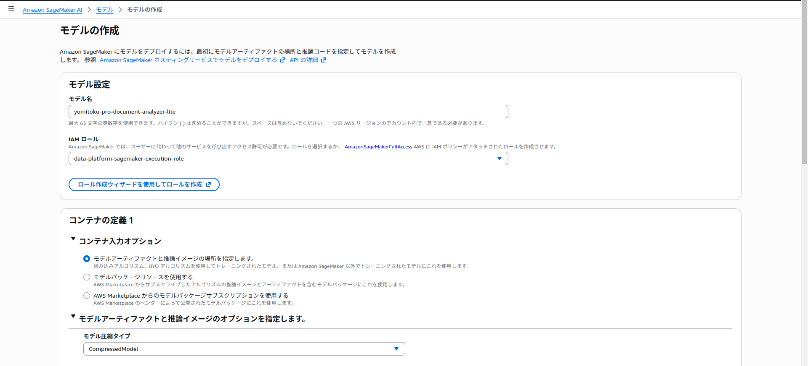
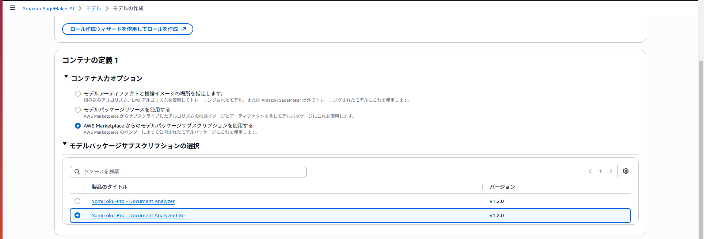
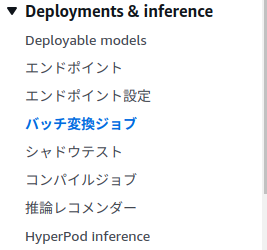
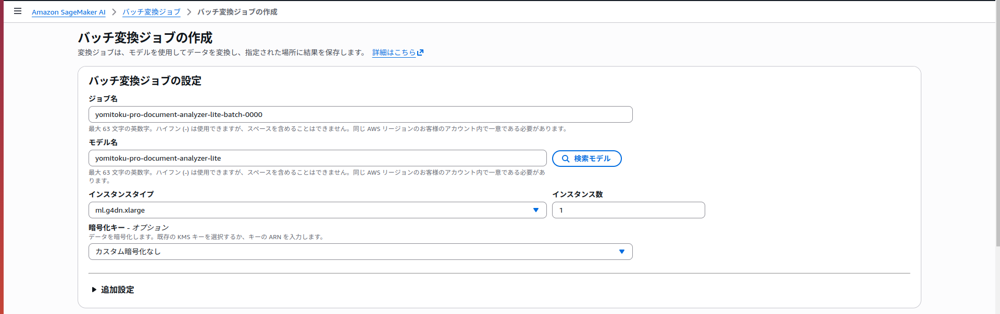
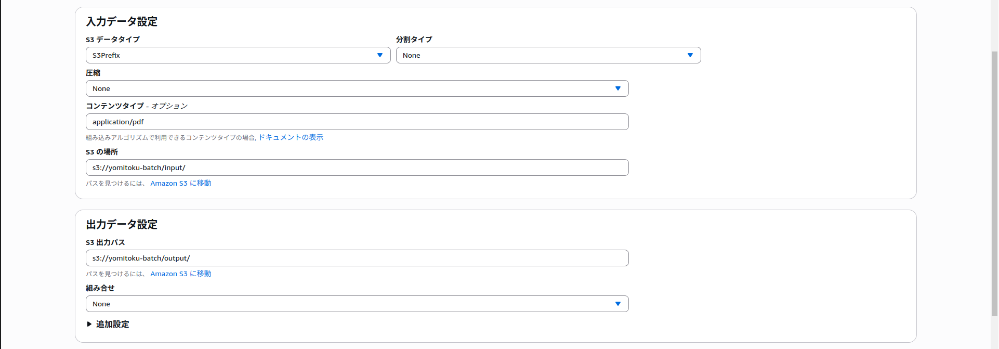
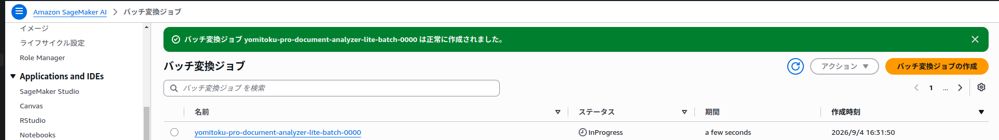

# Batch Transformで文書を一括解析する

Amazon SageMaker AIのBatch Transformを使用すると、Amazon S3に保存したPDFや画像をジョブ単位でまとめて解析できます。ジョブの開始時に推論用インスタンスが起動し、完了後に自動で終了するため、夜間バッチや大量文書の一括処理に適しています。

このページでは、AWS Marketplace版YomiToku-Proのモデルを使ってBatch Transformジョブを実行し、解析結果をYomiToku-ClientでMarkdownやCSVへ変換するまでを説明します。

!!! note "利用できる推論方式"
    AWS Marketplaceのモデルパッケージでは、リアルタイム推論とBatch Transformを利用できます。非同期推論は利用できません。

## このページで行うこと

1. YomiToku-ProのAmazon SageMaker AIモデルを準備する
2. モデルの実行ロールへS3権限を設定する
3. 入力ファイルをS3へアップロードする
4. Batch Transformジョブを作成する
5. 出力された`.out`ファイルをダウンロードする
6. YomiToku-ClientでMarkdownやCSVへ変換する

このページでは、次の値を例として使用します。実際の環境に合わせて読み替えてください。

| 項目 | 例 |
| --- | --- |
| モデル名 | `yomitoku-pro-document-analyzer-lite` |
| ジョブ名 | `yomitoku-pro-document-analyzer-lite-batch-0000` |
| 入力先 | `s3://YOUR_BUCKET/input/` |
| 出力先 | `s3://YOUR_BUCKET/output/` |
| インスタンスタイプ | `ml.g4dn.xlarge` |
| リージョン | `ap-northeast-1` |

!!! warning "ジョブ名は実行ごとに変更してください"
    Batch Transformのジョブ名は、AWSアカウントとリージョン内で一意である必要があります。上記のジョブ名は初回実行用の例です。再実行時は末尾の番号や日時を変更してください。

## 事前準備

- AWS Marketplaceで利用するYomiToku-Pro製品をサブスクライブしていること
- サブスクライブしたモデルパッケージからAmazon SageMaker AIモデルを作成していること
- 入出力に使用するS3バケットがあること
- AWS CLIを使う場合は、認証情報とリージョンを設定していること

## 1. Amazon SageMaker AIモデルを準備する

モデルをまだ作成していない場合は、[Amazon SageMaker AIモデルを作成する](deploy-yomitoku-pro.md#create-sagemaker-model)の手順で作成してください。Batch Transformで必要なのはモデルまでです。リアルタイム推論用のエンドポイント設定やエンドポイントは作成しません。

<figure markdown="span">
  
  <figcaption>モデル名と、Batch Transformで使用するIAMロールを設定する</figcaption>
</figure>

### Model Package ARNを取得する {#get-model-package-arn}

AWS CLIでモデルを作成する場合は、サブスクライブした製品のModel Package ARNが必要です。Amazon SageMaker AIコンソールの **AWS Marketplace resources > モデルパッケージ** から対象製品とバージョンを開き、Model Package ARNをコピーします。

YomiToku-Clientをインストール済みの場合は、次のコマンドから対象製品のモデルパッケージ一覧を開けます。

```bash
# 通常版
yomitoku-client sagemaker configure \
  --product document-analyzer \
  --region ap-northeast-1

# Lite版
yomitoku-client sagemaker configure \
  --product document-analyzer-lite \
  --region ap-northeast-1
```

!!! warning "製品とリージョンを確認してください"
    通常版とLite版では、製品とModel Package ARNが異なります。Batch Transformジョブと同じリージョンにある、利用する製品のARNを選択してください。

既存モデルのModel Package ARNは、次のコマンドでも確認できます。

```bash
aws sagemaker describe-model \
  --model-name YOUR_MODEL_NAME \
  --query 'PrimaryContainer.ModelPackageName' \
  --output text \
  --region ap-northeast-1
```

### YomiToku-Pro - Document Analyzer Liteを利用する {#batch-lite-model}

Lite版は通常版とは別のAWS Marketplace製品です。Lite版製品をサブスクライブし、そのModel Package ARNからモデルを作成してください。環境変数やモデル名だけで通常版をLite版へ切り替えることはできません。

<figure markdown="span">
  
  <figcaption>利用するAWS Marketplaceのモデルパッケージを選択する</figcaption>
</figure>

## 2. モデルの実行ロールへS3権限を設定する {#batch-transform-execution-role}

!!! warning "S3へアクセスするのはモデル作成時の実行ロールです"
    Batch TransformがS3の入力ファイルを読み書きするときは、**モデルの作成時に選択した実行ロール（Execution role）**が使われます。AWSマネジメントコンソールへサインインしているAdminロールや、AWS CLIのプロファイルに付与したS3権限は使われません。

実行ロールは、Amazon SageMaker AIコンソールの **Deployments & inference > モデル > 対象モデル** にある **Execution role ARN**で確認できます。AWS CLIでは次のコマンドを実行します。

```bash
aws sagemaker describe-model \
  --model-name yomitoku-pro-document-analyzer-lite \
  --query ExecutionRoleArn \
  --output text \
  --region ap-northeast-1
```

実行ロールには、入力プレフィックスの一覧・読み取り権限と、出力プレフィックスへの書き込み権限を付与します。次は、`s3://YOUR_BUCKET/input/`から読み取り、`s3://YOUR_BUCKET/output/`へ書き込む場合の例です。

```json
{
  "Version": "2012-10-17",
  "Statement": [
    {
      "Effect": "Allow",
      "Action": "s3:ListBucket",
      "Resource": "arn:aws:s3:::YOUR_BUCKET",
      "Condition": {
        "StringLike": {
          "s3:prefix": ["input", "input/*"]
        }
      }
    },
    {
      "Effect": "Allow",
      "Action": "s3:GetObject",
      "Resource": "arn:aws:s3:::YOUR_BUCKET/input/*"
    },
    {
      "Effect": "Allow",
      "Action": "s3:PutObject",
      "Resource": "arn:aws:s3:::YOUR_BUCKET/output/*"
    }
  ]
}
```

## 3. 入力ファイルをS3へアップロードする

次の例では、ローカルの`input`ディレクトリにあるPDFをアップロードします。

```bash
aws s3 cp ./input/ s3://YOUR_BUCKET/input/ \
  --recursive \
  --exclude "*" \
  --include "*.pdf"
```

入力形式に応じて、ジョブへ次のContent-Typeを指定します。

| 入力形式 | Content-Type |
| --- | --- |
| PDF | `application/pdf` |
| JPEG | `image/jpeg` |
| PNG | `image/png` |
| TIFF | `image/tiff` |

!!! warning "1つのジョブには同じ形式のファイルを入れてください"
    Content-Typeはジョブ全体で1つだけ指定します。PDFとPNGなど、形式の異なるファイルは入力プレフィックスまたはジョブを分けてください。また、出力プレフィックスは入力プレフィックスの外に設定してください。

## 4. Batch Transformジョブを作成する

### AWSマネジメントコンソールを使う場合

1. 入力ファイルと同じリージョンのAmazon SageMaker AIコンソールを開きます。
2. **Deployments & inference > バッチ変換ジョブ** を開きます。

    <figure markdown="span">
      { width="267" }
      <figcaption>Deployments & inferenceからバッチ変換ジョブを開く</figcaption>
    </figure>

3. **バッチ変換ジョブを作成** を選択します。
4. ジョブ名とYomiToku-Proのモデル名を指定します。
5. 対応するインスタンスタイプとインスタンス数を指定します。最初は1台での動作確認を推奨します。

    <figure markdown="span">
      
      <figcaption>ジョブ名、モデル、インスタンスを設定する</figcaption>
    </figure>

6. 入力データを次のように設定します。

    | 項目 | 設定値 |
    | --- | --- |
    | S3データタイプ | `S3Prefix` |
    | S3の場所 | `s3://YOUR_BUCKET/input/` |
    | Content-Type | `application/pdf` |
    | 圧縮タイプ | `None` |
    | 分割タイプ | `None` |

7. 出力データを次のように設定します。

    | 項目 | 設定値 |
    | --- | --- |
    | S3出力先 | `s3://YOUR_BUCKET/output/` |
    | Accept | `application/json` |
    | 結合方法 | `None` |

    <figure markdown="span">
      
      <figcaption>S3の入力先、Content-Type、出力先を設定する</figcaption>
    </figure>

8. ジョブを作成します。

    <figure markdown="span">
      
      <figcaption>ジョブが作成され、文書の解析が開始される</figcaption>
    </figure>

`SplitType=None`を指定すると、1つのPDFまたは画像が1回の推論リクエストとして渡されます。複数のファイルは複数のインスタンスで処理できますが、1つの大きなPDFが複数のインスタンスへ分割されるわけではありません。大きなPDFで処理時間が問題になる場合は、事前にファイルを分割してください。

### AWS CLIを使う場合

次のコマンドはPDFを処理する例です。

```bash
aws sagemaker create-transform-job \
  --transform-job-name yomitoku-pro-document-analyzer-lite-batch-0000 \
  --model-name yomitoku-pro-document-analyzer-lite \
  --transform-input 'DataSource={S3DataSource={S3DataType=S3Prefix,S3Uri=s3://YOUR_BUCKET/input/}},ContentType=application/pdf,CompressionType=None,SplitType=None' \
  --transform-output 'S3OutputPath=s3://YOUR_BUCKET/output/,Accept=application/json,AssembleWith=None' \
  --transform-resources 'InstanceType=ml.g4dn.xlarge,InstanceCount=1' \
  --max-concurrent-transforms 1 \
  --max-payload-in-mb 100 \
  --region ap-northeast-1
```

`MaxPayloadInMB`の既定値は6 MB、設定可能な最大値は100 MBです。この例では6 MBを超えるPDFも処理できるよう、100 MBを指定しています。100 MBを超えるファイルは事前に分割してください。

JPEG、PNG、TIFFを処理するときは、`ContentType`を入力形式に合わせて変更します。

### ジョブの状態を確認する

```bash
aws sagemaker describe-transform-job \
  --transform-job-name yomitoku-pro-document-analyzer-lite-batch-0000 \
  --query '{Status:TransformJobStatus,FailureReason:FailureReason}' \
  --region ap-northeast-1
```

`TransformJobStatus`が`Completed`になれば完了です。`Failed`の場合は、`FailureReason`とAmazon CloudWatch Logsの`/aws/sagemaker/TransformJobs`を確認してください。

## 5. `.out`ファイルを確認・ダウンロードする {#download-batch-output}

出力先を一覧表示します。

```bash
aws s3 ls s3://YOUR_BUCKET/output/ --recursive
```

入力したオブジェクトごとに、元のファイル名に`.out`を付けたJSONファイルが作成されます。

```text
入力: s3://YOUR_BUCKET/input/document.pdf
出力: s3://YOUR_BUCKET/output/document.pdf.out
```

入力プレフィックス以下にサブフォルダがある場合は、その階層に応じたサブフォルダへ保存されます。実際のS3 URIは`aws s3 ls`の結果で確認してください。

```bash
aws s3 cp \
  s3://YOUR_BUCKET/output/document.pdf.out \
  ./document.pdf.out
```

## 6. YomiToku-ClientでMarkdownやCSVへ変換する

`.out`ファイルにはYomiToku-Proの解析結果がJSON形式で保存されています。`yomitoku-client convert`を使用すると、再推論せずにMarkdown、CSV、HTMLへ変換できます。

```bash
yomitoku-client convert document.pdf.out \
  --format md,csv,html \
  --output-dir ./converted
```

元のPDFを保管している場合は、`--src`を指定するとMarkdownやHTMLで使用する図の切り出し画像も出力できます。

```bash
yomitoku-client convert document.pdf.out \
  --format md,html \
  --src document.pdf \
  --output-dir ./converted
```

ローカルでの確認だけでなく、実運用ではAWS LambdaなどでYomiToku-Clientを実行し、Batch Transformの出力を後続システム向けの形式へ変換する構成を想定しています。詳細は[Batch Transform出力の変換](cli-usage.md#batch-transform)を参照してください。

## 定期的に実行する場合

Batch Transform自体にはスケジュール機能がありません。定期実行する場合は、次のようにAWSサービスを組み合わせます。

```text
EventBridge Scheduler
        ↓
Step Functions
        ↓
Amazon SageMaker AI Batch Transform
        ↓
出力先S3 ──→ AWS Lambda（YomiToku-Client）──→ 後続システム
```

EventBridge SchedulerからStep Functionsを起動し、Step FunctionsからBatch Transformジョブを作成します。ジョブ完了後は、AWS LambdaなどでYomiToku-Clientを実行してMarkdownやCSVへ変換できます。

定期実行で同じ入力プレフィックスを指定すると、既存ファイルも再処理されます。`input/YYYY-MM-DD/`のように実行単位でプレフィックスを分け、ジョブ名も実行ごとに変更してください。

## トラブルシューティング

### `getObjectMetadata`で`403 Forbidden`になる

```text
Got client error from S3 due to '403 Forbidden' processing getObjectMetadata
```

`getObjectMetadata`は、S3オブジェクトのサイズやContent-Typeを確認する`HeadObject`相当の処理です。`s3:GetObjectMetadata`というIAMアクションを追加する必要はありません。対象モデルの実行ロールに、入力オブジェクトへの`s3:GetObject`があるか確認してください。

コンソールから作成したモデルとAWS CLIから作成したモデルでは、実行ロールが異なることがあります。まずジョブのモデル名を確認し、続けてモデルの`ExecutionRoleArn`を確認します。

```bash
aws sagemaker describe-transform-job \
  --transform-job-name YOUR_JOB_NAME \
  --query ModelName \
  --output text \
  --region ap-northeast-1

aws sagemaker describe-model \
  --model-name YOUR_MODEL_NAME \
  --query ExecutionRoleArn \
  --output text \
  --region ap-northeast-1
```

### `Unsupported content type`になる

`TransformInput.ContentType`と入力ファイルの形式が一致しているか確認してください。同じ入力プレフィックスへPDFと画像を混在させないでください。

### 出力ファイルが見つからない

`aws s3 ls s3://YOUR_BUCKET/output/ --recursive`を実行し、出力プレフィックス以下を確認してください。入力キーの階層に応じたサブフォルダへ保存されている場合があります。

### ジョブが`Failed`になる

`describe-transform-job`の`FailureReason`と、Amazon CloudWatch Logsの`/aws/sagemaker/TransformJobs`を確認してください。大きなファイルだけが失敗する場合は、ペイロードサイズや処理時間を切り分けるため、小さなPDFまたは画像で再実行してください。

## 関連ドキュメント

- [YomiToku-ProをAmazon SageMaker AIへデプロイする](deploy-yomitoku-pro.md)
- [Batch Transform出力を変換する](cli-usage.md#batch-transform)
- [Amazon SageMaker AIのBatch Transform](https://docs.aws.amazon.com/ja_jp/sagemaker/latest/dg/batch-transform.html)
