# YomiToku-Proのデプロイ

!!! tip "前提"
    このページは [YomiToku-ClientのAWS認証設定ガイド](./iam-doc.md) の「SageMakerエンドポイントを作成・更新・削除する権限」が付与されたIAMを利用していることを前提にしています。
    まだ前の手順が未完了の場合は、まずそちらをご覧ください。

YomiToku-Clientをご利用いただくには、AWS Marketplaceを通じてYomiToku-Proのサブスクリプションに加入し、YomiToku-ProのSageMakerエンドポイントをデプロイする必要があります。

YomiToku-ProをAWS Marketplaceを通してデプロイするには、次の３つの方法があります。
各デプロイ方法の特徴を特徴を踏まえて、どちらかの方法を選びましょう。

|デプロイ方法|リソースの管理方法|特徴|
|:--:|:--:|:--:|
|[yomitoku-clientによるデプロイ](#yomitoku-client)|スタックでまとめて管理|お手軽に設定・管理。CLIで操作|
|[AWS SageMaker単体によるデプロイ](#aws-sagemaker)|個別に管理|詳細に設定・管理可能。ブラウザで操作|
|[AWS CloudFormationによるデプロイ](#aws-cloudformation)|スタックでまとめて管理|お手軽に設定・管理。ブラウザで操作|


## yomitoku-clientでデプロイする場合

### yomitoku-clientによるデプロイと管理

`yomitoku-client` のCLIツールを使用すると、コマンドラインから簡単にSageMakerエンドポイントの作成、状態確認、削除を行うことができます。内部的にはAWS CloudFormationを利用しているため、関連するリソース（モデル、エンドポイント設定、エンドポイント）を「スタック」として一括管理できます。

### デプロイの流れ

1. 初期設定（ARNの取得と登録）
2. エンドポイントのデプロイ
3. ステータスの確認
4. エンドポイントの削除（アンデプロイ）

### コマンドリファレンスまとめ


| コマンド | 用途 |
| --- | --- |
| `configure` | モデルパッケージARNの設定 |
| `deploy` | CloudFormationによるエンドポイント作成・更新 |
| `list` | 管理している全スタックの状態一覧 |
| `describe` | 特定スタックのステータス詳細 |
| `delete` | スタックの削除（リソースの全削除） |


### Step 1: 初期設定（ARNの取得と登録）

最初に、AWS Marketplaceで購読している製品の「モデルパッケージARN」を取得してクライアントに設定する必要があります。

!!! important "通常版とLite版は別のMarketplace製品です"
    YomiToku-Pro通常版とYomiToku-Pro Lite版はMarketplaceのサブスクリプションが分かれており、モデルパッケージARNも異なります。使用する製品をそれぞれサブスクライブし、通常版を使う場合は通常版のARN、Lite版を使う場合はLite版のARNを取得してください。

1. ターミナルで以下のコマンドを実行します。

```bash
yomitoku-client sagemaker configure
```

2. 実行すると、SageMakerのモデルパッケージ一覧を開くURLが表示されます。

```text
Please sign in to the AWS account subscribed to YomiToku-Pro and open the following SageMaker URL.
--------------------------------------------------------------------------------
https://console.aws.amazon.com/sagemaker/home?region=ap-northeast-1#/model-packages
--------------------------------------------------------------------------------
Open AWS Marketplace resources > Model packages > AWS Marketplace subscriptions, then select YomiToku-Pro and its version.
If no packages are displayed, confirm the AWS account and region (ap-northeast-1).
```

3. YomiToku-Proを購読したAWSアカウントでログインし、左側の **AWS Marketplace resources > モデルパッケージ** を開きます。**AWS Marketplaceサブスクリプション**から使用する製品（通常版またはLite版）とバージョンを選び、**Model Package ARN**（`arn:aws:sagemaker:...` で始まる文字列）をコピーします。Lite版を利用する場合は、必ずLite版製品のサブスクリプションを開いてください。

4. ターミナルのプロンプトにコピーしたARNを貼り付けてエンターキーを押します。
```text
Please enter the Model Package ARN: arn:aws:sagemaker:ap-northeast-1:123456789012:model-package/yomitoku-pro-xxx
Successfully configured Model Package ARN!

```

!!! note
    `configure`が保存するARNは1件です。別のARNで再実行すると保存値が上書きされます。通常版とLite版を切り替える場合は、使用する製品のARNで`configure`を再実行してからデプロイしてください。ARNは製品、リージョン、バージョンごとに異なります。

#### URLからModel Package ARNを取得できない場合 {#arn-fallback}

`configure`が表示した画面に対象製品が表示されない場合は、[Step 1: SageMakerモデルを作成する](#create-sagemaker-model)の手順で対象製品からモデルを作成した後、次の手順でARNを確認します。

1. SageMaker AIコンソールの左側から **Deployments & inference > モデル** を開きます。
2. 作成したモデルを選択します。
3. モデル詳細画面のコンテナ定義に表示される **Model package name**（`arn:aws:sagemaker:...:model-package/...`）をコピーします。

作成したモデル名が分かる場合は、AWS CLIでも同じARNを取得できます。

```bash
aws sagemaker describe-model \
  --model-name YOUR_MODEL_NAME \
  --query 'PrimaryContainer.ModelPackageName' \
  --output text \
  --profile YOUR_AWS_PROFILE \
  --region ap-northeast-1
```


### Step 2: エンドポイントのデプロイ

設定したARNを用いて、SageMakerエンドポイントを作成します。

1. 以下のコマンドを実行してデプロイを開始します。

```bash
yomitoku-client sagemaker deploy \
  --endpoint-name yomitoku-sagemaker \
  --instance-type ml.g4dn.xlarge \
  --profile YOUR_AWS_PROFILE \
  --region ap-northeast-1
```

Lite版をデプロイする場合は、先に`configure`でLite版製品のARNを設定してからデプロイします。

```bash
yomitoku-client sagemaker configure \
  --profile YOUR_AWS_PROFILE \
  --region ap-northeast-1

yomitoku-client sagemaker deploy \
  --endpoint-name yomitoku-sagemaker-lite \
  --instance-type ml.g4dn.xlarge \
  --profile YOUR_AWS_PROFILE \
  --region ap-northeast-1
```


`deploy`のオプション


| オプション | デフォルト値 | 説明 |
| --- | --- | --- |
| `--endpoint-name` | `yomitoku-sagemaker` | 作成するエンドポイントの名前。CloudFormationのスタック名にも利用されます。 |
| `--instance-type` | `ml.g4dn.xlarge` | 使用するインスタンスタイプ。`ml.g4dn.xlarge`, `ml.g5.xlarge`, `ml.g6.xlarge`, `ml.c7i.xlarge`, `ml.c7i.2xlarge` が選択可能。検証用途ならデフォルトの`ml.g4dn.xlarge`で十分。性能を求める場合はg5やg6系, インフラコストの安いCPUインスタンス利用の場合はc7i系を推奨。 |
| `--instance-count` | `1` | デプロイするインスタンス数。 |
| `--model-package-arn` | 設定ファイルの値 | デプロイするModel Package ARN。通常は省略し、`configure`で`~/.yomitoku/config.json`へ保存したARNを使用します。ARN内のリージョンは`--region`と一致させてください。 |
| `--profile` | AWS SDKの既定値 | 使用するAWS CLIプロファイル。AssumeRoleやMFAを使う場合も対象のプロファイル名を指定します。 |
| `--region` | AWS SDKの既定値 | デプロイ先のAWSリージョン。未設定時はAWS SDKの設定に従います。Model Package ARNと同じリージョンを指定してください。 |


!!! warning

    サービスはスタックをデプロイしてから、スタックを削除するまで、従量課金で料金が発生します。サービスの利用を終了する場合は、必ず削除コマンド`yomitoku-client sagemaker delete`を実行してください。

### Step 3: ステータスの確認 

デプロイには通常数分〜10分程度の時間がかかります。現在の状態を確認するには以下のコマンドを使用します。

- スタック一覧の表示

    作成済みの管理スタックとその状態を一覧表示します。

    ```bash
    yomitoku-client sagemaker list
    ```

- 詳細情報の表示

    特定のエンドポイント（スタック）の詳細な情報を取得します。

    ```bash
    yomitoku-client sagemaker describe --endpoint-name yomitoku-sagemaker
    ```

    ステータスが `CREATE_COMPLETE` になっていれば、エンドポイントは正常に起動し、推論が可能な状態です。


### Step 4: エンドポイントの削除（アンデプロイ）

利用を終了する場合は、課金を止めるためにスタックを削除します。この操作により、エンドポイント、エンドポイント設定、モデルのすべてが自動的に削除されます。

1. 以下のコマンドを実行します。
```bash
yomitoku-client sagemaker delete \
  --endpoint-name yomitoku-sagemaker \
  --profile YOUR_AWS_PROFILE \
  --region ap-northeast-1
```

2. 削除が開始されます。完全に削除されたかどうかは `yomitoku-client sagemaker list` コマンドで確認してください。

`delete`のオプション

| オプション | デフォルト値 | 説明 |
| --- | --- | --- |
| `--endpoint-name` | `yomitoku-sagemaker` | 削除するエンドポイント名です。同じ名前のCloudFormationスタックと、そのスタックが管理するモデル、エンドポイント設定、エンドポイントを削除します。別のエンドポイントを誤って削除しないよう、デプロイ時と同じ名前を指定してください。 |
| `--profile` | AWS SDKの既定値 | 削除に使用するAWS CLIプロファイル。デプロイ時と同じプロファイルを指定します。 |
| `--region` | AWS SDKの既定値 | スタックが存在するリージョン。デプロイ時と同じリージョンを指定します。 |

### デプロイに失敗した場合

作成に失敗したCloudFormationスタックが`ROLLBACK_COMPLETE`になると、そのスタックは更新できません。原因を修正しただけで`deploy`を再実行せず、デプロイ時と同じ`--endpoint-name`、`--profile`、`--region`を指定して一度削除してください。

```bash
yomitoku-client sagemaker delete \
  --endpoint-name yomitoku-sagemaker \
  --profile YOUR_AWS_PROFILE \
  --region ap-northeast-1
```

削除完了後に、正しいModel Package ARNなどを指定して`deploy`を再実行します。スタックがまだ`ROLLBACK_IN_PROGRESS`の場合は、ロールバック完了後に削除してください。


## AWS SageMakerでデプロイをする場合

### AWS SageMakerでデプロイ

AWS Marketplaceを用いてAWS SageMakerでデプロイします。
SageMakerモデルの作成までは、リアルタイム推論とBatch Transformで共通です。モデルを作成した後、利用する推論方式へ進みます。

1. モデルの作成
2. 推論方式の選択
    - リアルタイム推論: エンドポイント設定とエンドポイントを作成
    - Batch Transform: Batch Transformジョブを作成

モデルの作成だけでは推論インスタンスの料金は発生しません。リアルタイム推論ではエンドポイントの稼働中、Batch Transformではジョブの実行中にインスタンス料金とソフトウェア利用料が発生します。

### Step 1: SageMakerモデルを作成する {#create-sagemaker-model}

1. [AWS マネジメントコンソール](https://aws.amazon.com/jp/console/)にサインインします。
1. 左上の検索ウィンドウから使用する製品を検索し、通常版ではYomiToku-Pro、Lite版ではYomiToku-Pro Lite版の製品を選択します。両方を利用する場合は、それぞれ個別にサブスクライブしてください。
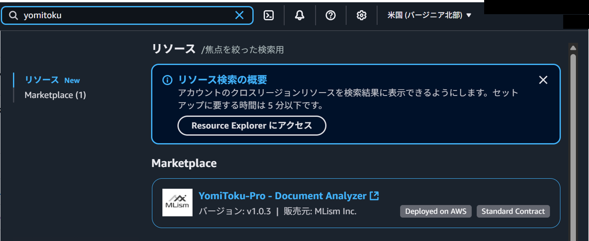
1. 右上のContinue to Subscribeを選択し、次のページでも右上のContinue to configurationを選択します。
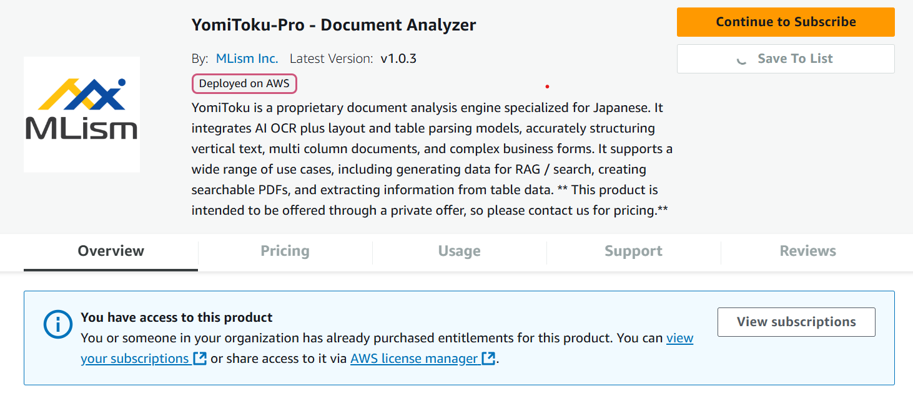
1. launch methodでSageMaker Consoleを選択します。
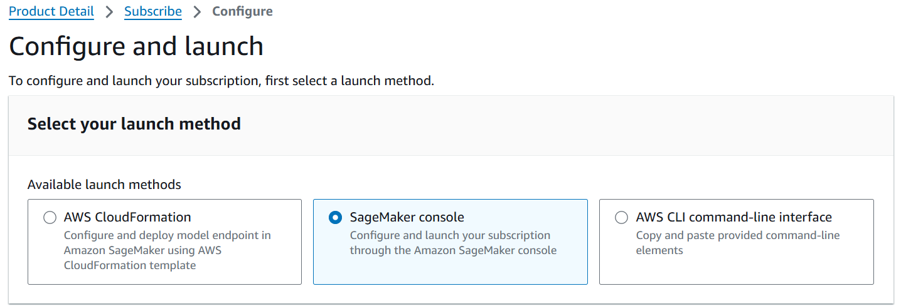
1. Software Versionは、特別な理由がない限り最新版を選択します。利用するRegionを選択し、Amazon SageMaker optionsで利用する推論方式を選択します。
    - リアルタイム推論: **Create a real-time inference endpoint**
    - Batch Transform: **Create a batch transform job**
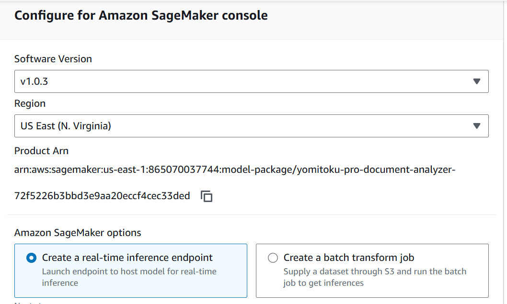
1. モデルの設定をします。モデル名を設定し、ロールを設定します。「新しいロールの作成」を選択した際に自動作成されるロールを利用することを推奨します。「ロール作成ウィザードを使用してロールを作成」を選択するとロール名やロールに与える権限をより詳細に設定してロールを作成できます。2回目以降など、既にロールが存在している場合は新しくロールを作成する必要はありません。ロールの設定画面を開く場合は、本ドキュメントの「付録:各種設定画面の開き方」をご確認ください。
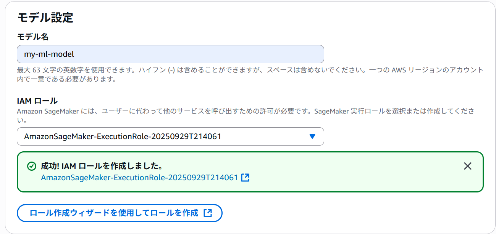
1. コンテナの定義1のコンテナ入力オプションで「AWS Marketplaceからのモデルパッケージサブスクリプションを使用する」を選択します。（デフォルト設定）
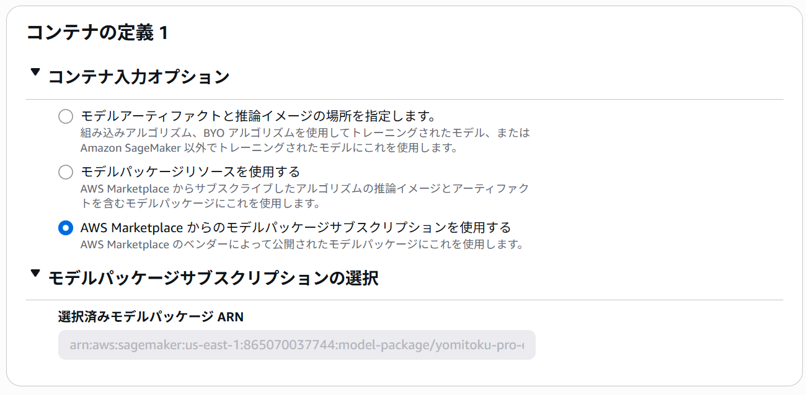
1. 「モデルパッケージサブスクリプションの選択」で使用する製品の行を選択します。通常版では通常版のサブスクリプション、Lite版ではLite版のサブスクリプションを選択します。Lite版を環境変数で切り替える必要はありません。詳細は[軽量モードを利用する](batch-transform.md#batch-lite-model)を参照してください。

1. VPCはAWS上に構築する仮想的なプライベートネットワークです。AWS上の他のサービスから接続する際にVPCを用いることでセキュアな通信経路を構築できます。VPCの設定は必要に応じて設定します。（VPCの設定は必須ではありません。）詳しくは[こちらの公式ドキュメント](https://docs.aws.amazon.com/ja_jp/sagemaker/latest/dg/host-vpc.html)をご確認ください。タグは、AWSリソースに設定するキーと値のペアです。リソースの識別、分類、管理を目的として、必要に応じて設定します。詳しくは[こちらの公式ドキュメント](https://docs.aws.amazon.com/ja_jp/whitepapers/latest/tagging-best-practices/what-are-tags.html)をご確認ください。
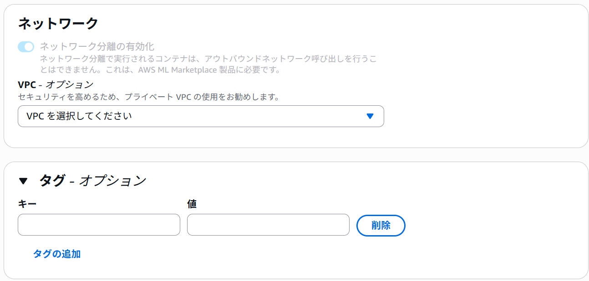
1. 右下の「次へ」をクリックしてモデルの作成を完了します。

モデルを作成した後は、利用する推論方式の手順へ進んでください。

- リアルタイム推論: 次の「Step 2: リアルタイムエンドポイントを作成する」へ進む
- Batch Transform: [Batch Transformを実行する](batch-transform.md)へ進む。エンドポイント設定とエンドポイントの作成は不要

### Step 2: リアルタイムエンドポイントを作成する

!!! info "Batch Transformを利用する場合"
    このStepは不要です。[Batch Transformを実行する](batch-transform.md)へ進んでください。

1. エンドポイント名を設定し、エンドポイント設定のアタッチの項目の選択をします。既存のエンドポイント設定を使用する場合は「既存のエンドポイント設定の使用」を、新しくエンドポイント設定を作成する場合は「新しいエンドポイント設定の作成」を選択します。「既存のエンドポイント設定の使用」を選択した場合は使用するエンドポイント設定を選択して、バリアントの設定まで移ってください。「新しいエンドポイントの作成」を選択した場合について説明します。
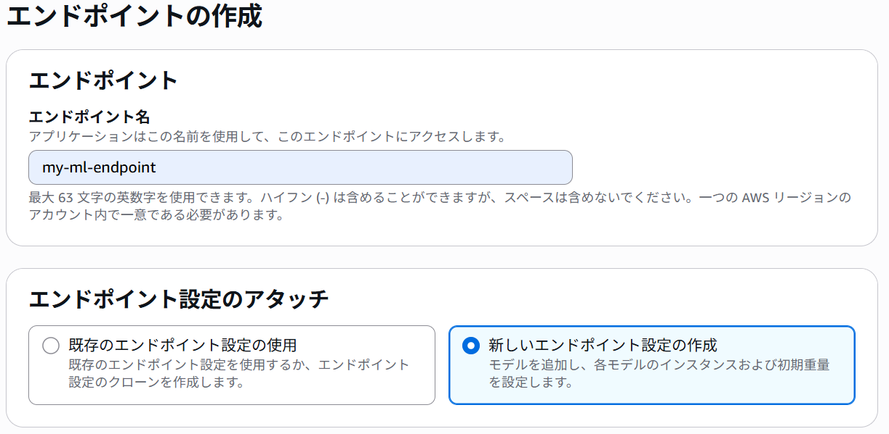
1. エンドポイント設定名を設定します。エンドポイントのタイプはプロビジョン済みを選択します。暗号化キーを設定することでSageMakerがS3にデータを保存する際に用いられるAWS KMSキーを、お客様が管理・指定できます。暗号化キーは適宜設定します。（暗号化キーの設定は必須ではありません。）暗号化キーについては詳しくは[こちらの公式ドキュメント](https://docs.aws.amazon.com/ja_jp/sagemaker/latest/dg/encryption-at-rest.html)をご確認ください。プロビジョン済みのタイプではエンドポイントを作成してから削除するまでモデルをホストするコンテナが起動し続けます。サーバーレス推論はGPUをサポートしていないのでYomiToku-Proではご利用いただけません。
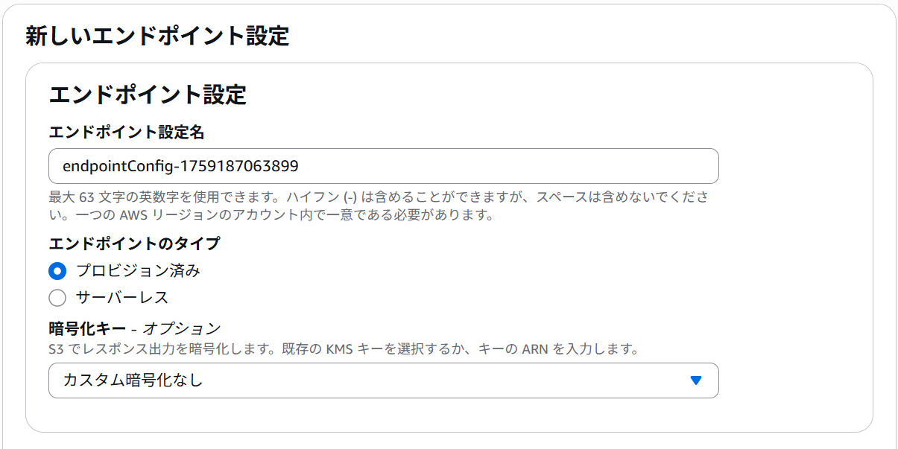
1. 非同期呼び出し設定のトグルとデータキャプチャのトグルはオフに設定します。非同期呼び出し設定は現時点ではYomiToku-Proでサポートされていません。データキャプチャはここでは利用しません。
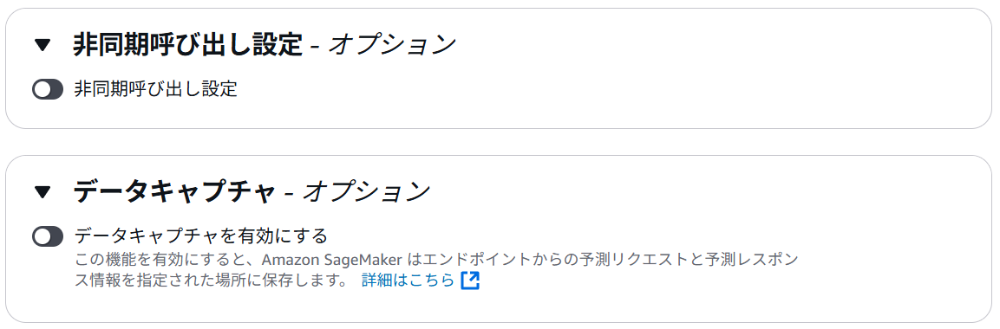
1. インスタンスタイプやインスタンス数などを変更する際はバリアントの設定をします。インスタンスタイプによってインスタンスの性能とコストが変わります。本番稼働の下にあるスクロールバーを右にスクロールします。
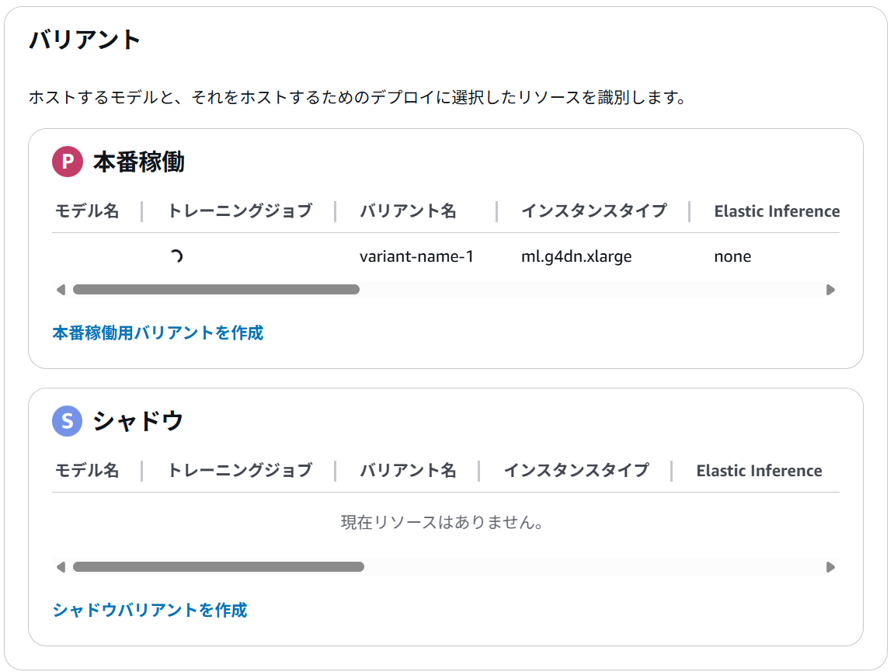
アクションの欄にある「編集」をクリックします。
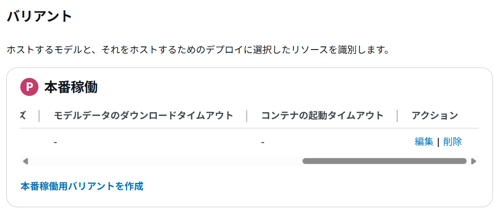
インスタンスタイプを選択します。検証の場合はml.g4dn.xlargeで十分ですが、性能を求める場合はml.g5.xlargeを選択します。`ml.c7i.xlarge`, `ml.c7i.2xlarge`を利用するとCPUインスタンスも選択できます。通常版とLite版のどちらが動作するかは、モデル作成時に選択したMarketplace製品のモデルパッケージで決まります。初期インスタンス数を設定します。インスタンス数に応じて同時に処理できるリクエストの数が増えますが、コストもインスタンス数に比例して増加します。その他の設定はここでは利用しません。
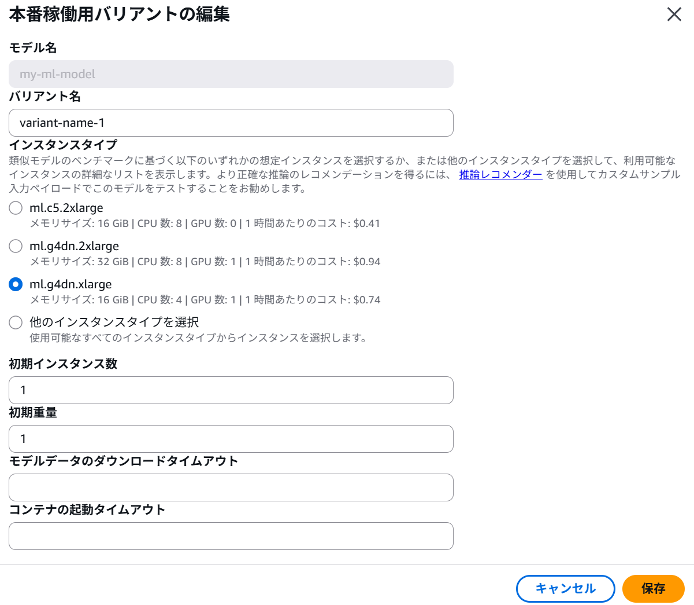
1. 右下の「保存」をクリックしてバリアントの設定を保存します。
1. シャドウバリアントの設定はここでは利用しません。
1. 「エンドポイント設定の作成」をクリックしてエンドポイント設定の作成を完了します。
1. タグの設定は必要な場合は設定します。
1. 右下の「送信」をクリックしてエンドポイントの作成を完了します。
1. エンドポイントの作成には時間がかかります。
ステータスCreatingがステータスInServiceになるのを待ちます。
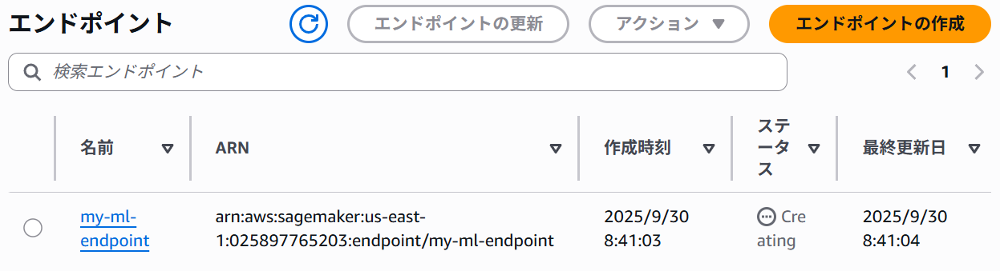
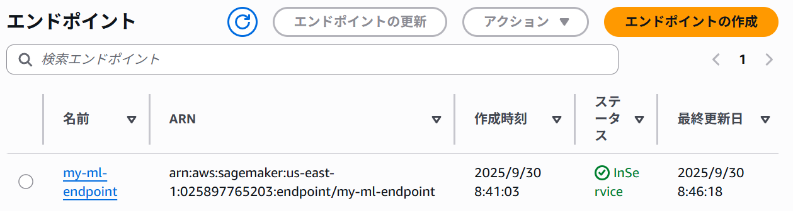

!!! warning
    サービスはエンドポイントをデプロイしてから、エンドポイントを削除するまで、従量課金で料金が発生します。サービスの利用を終了する場合は、必ずエンドポイントを削除してください。

---

### AWS SageMakerでアンデプロイ

次の順番でアンデプロイをします。

1. エンドポイントの削除
1. エンドポイント設定の削除
1. モデルの削除

1. [AWS マネジメントコンソール](https://aws.amazon.com/jp/console/)にサインインします。
1. 左上の検索ウィンドウからAmazon SageMaker AIを検索します。
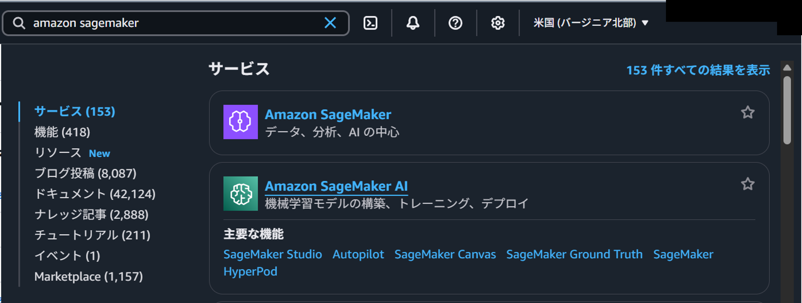
1. 左側のメニューをスクロールし、左側のトグルで推論の項目を開きます。
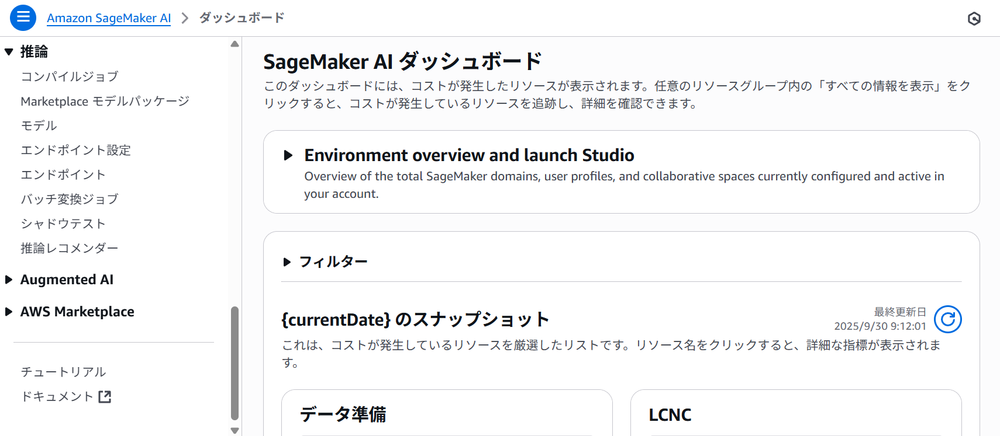
1. 左側のメニューから推論>エンドポイントを開きます。作成したエンドポイント名をクリックします。作成したエンドポイントの設定画面の右上の削除ボタンをクリックします。
1. 左側のメニューから推論>エンドポイント設定を開きます。作成したエンドポイント設定名をクリックします。作成したエンドポイント設定の設定画面の右上の削除ボタンをクリックします。
1. 左側のメニューから推論>モデルを開きます。作成したモデル名をクリックします。作成したモデルの設定画面の右上のアクションボタンをクリックし、削除をクリックします。

既存のモデルやエンドポイント設定からエンドポイントを作成する際は、それぞれの設定画面（モデル設定画面、エンドポイント設定画面など）を開いて操作します。

---

## AWS CloudFormationでデプロイする場合

CloudFormationでは、AWSリソースのセット全体をスタックという単位で一元管理します。
スタックには、AWS SageMakerのモデル・エンドポイント設定・エンドポイントのリソースなどが含まれています。
デプロイの際はスタックを作成し、アンデプロイの際はスタックを削除します。
スタックが作成されてからスタックが削除されるまで料金が発生し続けます。

### AWS CloudFormationでデプロイ

1. [AWS マネジメントコンソール](https://aws.amazon.com/jp/console/)にサインインします。
1. 左上の検索ウィンドウからYomiToku-Proを検索し、選択します。

1. 右上のContinue to Subscribeを選択し、次のページでも右上のContinue to configurationを選択します。

1. launch methodでAWS CloudFormationを選択します。
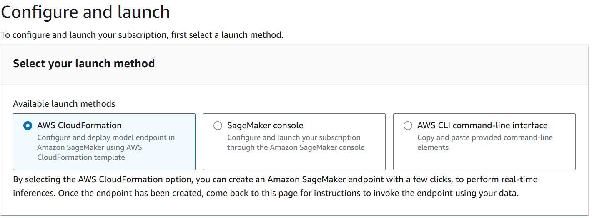
1. Software Versionは、特別な理由がない限り、最新版を選択します。Regionは、使用するものを選択します。
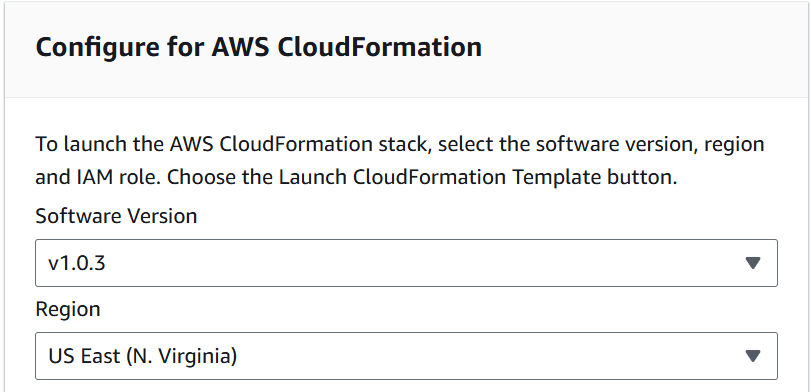
1. YomiToku-Proの2回目以降のデプロイの場合など、既にロールが存在している場合は「Use an existing service role」を選択し、そのロールを選択します。初めての場合は「Create and use a new service role」を選択します。AmazonSagemaker-ExecutionRoleから始まる名前のロールが作成されます。CloudFormationのスタック内で既存のS3バケットを利用（参照）したい場合や、その設定をスタックで管理したい場合には、バケット名を指定します。
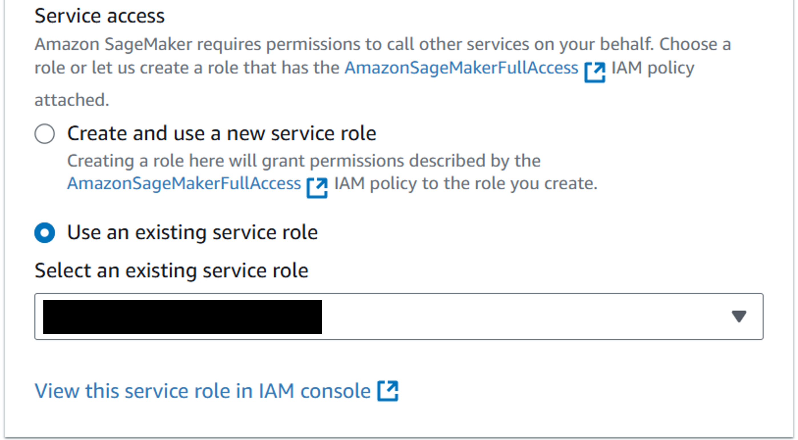
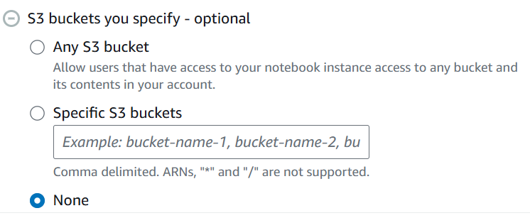
1. スタック名を設定します。
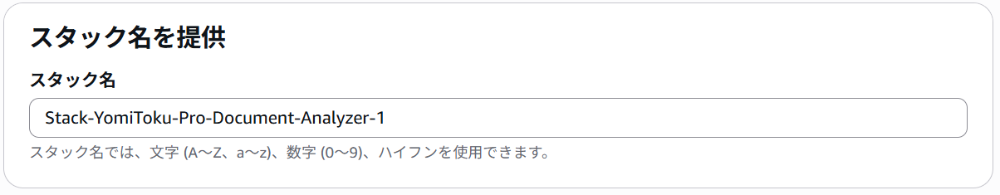
1. エンドポイント名、インスタンス数、インスタンスタイプを設定します。インスタンス数に応じて同時に処理できるリクエストの数が増えますが、コストもインスタンス数に比例して増加します。インスタンスタイプは検証の場合はml.g4dn.xlargeで十分ですが、性能を求める場合はml.g5.xlargeを入力します。その他の項目については変更しません。
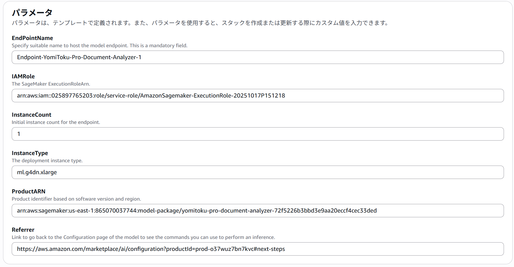
1. タグは、AWSリソースに設定するキーと値のペアです。リソースの識別、分類、管理を目的として、必要に応じて設定します。詳しくは[こちらの公式ドキュメント](https://docs.aws.amazon.com/ja_jp/whitepapers/latest/tagging-best-practices/what-are-tags.html)をご確認ください。
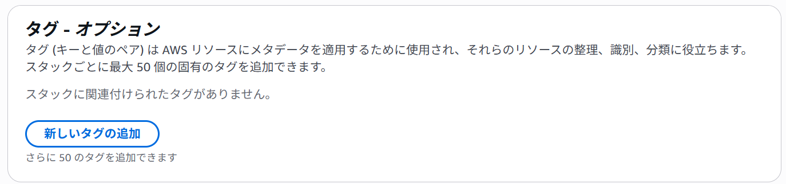
1. アクセス許可を必要に応じて設定します。デフォルトではユーザーの権限で実行されますが、IAMロールを指定してCloudFormationを実行したい場合は設定します。
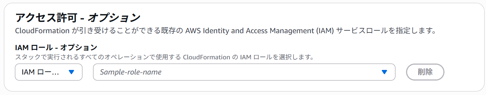
1. 「その他の設定」については特に理由が無ければデフォルト設定で構いません。詳細については[こちらのドキュメント](https://docs.aws.amazon.com/AWSCloudFormation/latest/UserGuide/cfn-console-create-stack.html?icmpid=docs_cfn_console#configure-stack-options)をご確認ください。
1. 右下の「スタックの作成」を選択します。
1. スタックの作成には時間がかかります。作成したスタックのステータスがCREATE_IN_PROGRESSからCREATE_COMPLETEになるまで待ちます。論理IDがスタック名、ステータスがCREATE_COMPLETEのイベントが発生したかどうかなどでスタックの作成が完了したかどうかを確認することができます。
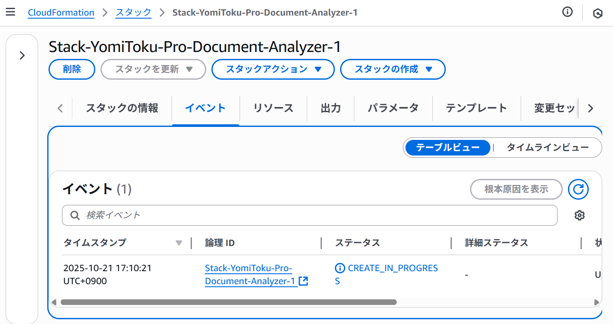
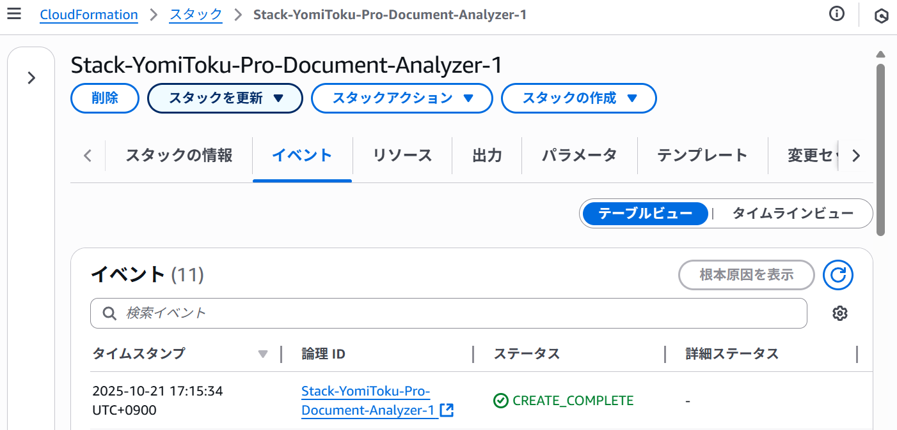

!!! warning
    サービスはスタックをデプロイしてから、スタックを削除するまで、従量課金で料金が発生します。サービスの利用を終了する場合は、必ずスタックを削除してください。

---

### AWS CloudFormationでアンデプロイ

1. [AWS マネジメントコンソール](https://aws.amazon.com/jp/console/)にサインインします。
1. 左上の検索ウィンドウからCloudFormationを検索します。
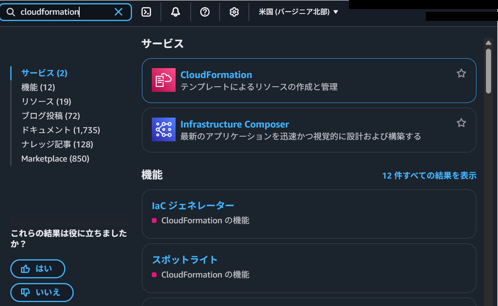
1. デプロイしたスタック名の左側の円形のチェックボックスを選択します。
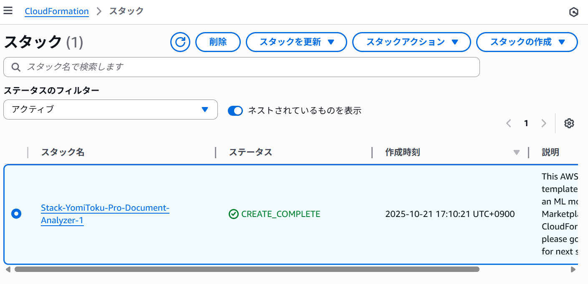
1. 上部にある「削除」を選択します。

## デプロイ後にYomiToku-Proを呼び出す

エンドポイントのステータスが`InService`になったら、YomiToku-Clientから文書解析を実行できます。呼び出し方法は、利用形態に応じて次のページを参照してください。

- コマンドラインから呼び出す: [CLI](cli-usage.md)
- Pythonコードから呼び出す: [Python API](module-usage.md)

どちらの場合も、デプロイ時に設定したエンドポイント名とAWSリージョンを指定します。ディレクトリ内のファイルを一括処理するCLIのバッチ処理と、Python APIによる同期・非同期呼び出しも利用できます。

Batch Transformを利用する場合はエンドポイントを呼び出さず、[Batch Transformを実行する](batch-transform.md)の手順でジョブを作成してください。

## 付録:各種設定画面の開き方

### ロール

ロールの設定画面はIAMから開くことができます。ロールの削除をしたい場合などはそちらをご利用ください。

次の手順でIAMの設定画面を開くことができます。

1. [AWS マネジメントコンソール](https://aws.amazon.com/jp/console/)にサインインします。
1. 左上の検索ウィンドウからIAMを検索します。
1. IAMを選択します。
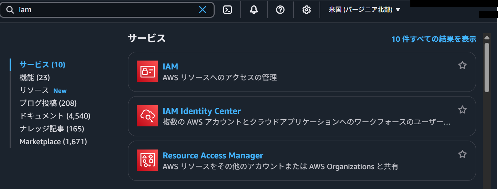
1. 左側のメニューでロールを選択します。

### AWS SageMakerのモデル・エンドポイント設定・エンドポイント

AWS SageMakerのモデル・エンドポイント設定・エンドポイントの設定画面はAmazon SageMaker AIの推論の項目から開くことができます。一度作成したモデルやエンドポイント設定からエンドポイントを作成することや、モデル・エンドポイント設定・エンドポイントの削除などができます。

次の手順でモデル・エンドポイント設定・エンドポイントの設定画面を開くことができます。

1. [AWS マネジメントコンソール](https://aws.amazon.com/jp/console/)にサインインします。
1. 左上の検索ウィンドウからAmazon SageMaker AIを検索します。

1. 左側のメニューをスクロールし、左側のトグルで推論の項目を開きます。

1. 設定したい項目に応じて左側のメニューで推論>モデル、推論>エンドポイント設定、推論>エンドポイントを選択します。

### AWS CloudFormationのスタック

AWS CloudFormationのスタックの設定画面はCloudFormationを検索すると開くことができます。

1. [AWS マネジメントコンソール](https://aws.amazon.com/jp/console/)にサインインします。
1. 左上の検索ウィンドウからCloudFormationを検索します。

1. CloudFormationを選択すると、スタックの設定画面が開くことができます。
