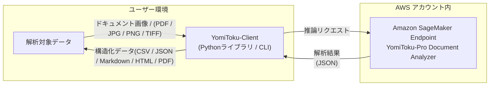

# YomiToku-Client

## 概要

YomiToku-Clientは、AWS SageMaker上で提供されるYomiToku-Pro APIの出力を扱うためのPythonクライアントライブラリです。OCR解析結果を構造化データへ変換し、CSV・JSON・Markdown・PDFなどの形式での保存や可視化を容易にします。YomiToku-Proの高精度OCRと、業務アプリケーションを結びつける「橋渡し」役を担います。



## 利用の手順
1. [YomiToku-Clientをインストール](installation.md)
1. [AWS Marketplace](https://aws.amazon.com/marketplace/pp/prodview-64qkuwrqi4lhi?sr=0-1&ref_=beagle&applicationId=AWSMPContessa)より**YomiToku-Pro - Document Analyzer**をサブスクライブ
1. [AWSの認証の設定する](iam-doc.md)
1. [SageMakerモデルを作成する](deploy-yomitoku-pro.md#create-sagemaker-model)
1. 利用する推論方式を選択する
    - リアルタイム推論: [エンドポイントを作成](deploy-yomitoku-pro.md)し、CLIまたはPython APIで解析する
    - Batch Transform: [Batch Transformジョブを実行](batch-transform.md)し、S3から`.out`を取得する
1. Batch Transformを利用した場合は、必要に応じて[`.out`をMarkdown / CSV / HTMLへ変換する](cli-usage.md#batch-transform)

## YomiToku-Clientの機能 
- AWS SageMakerで作成されたエンドポイントを簡単、安全かつ効率的に呼び出せます。
- 読み取り結果を多様な出力形式(CSV / JSON / Markdown / HTML / PDF)への変換をサポートします。
- 読み取り結果を可視化し、内容をすぐに確認できます。
- バッチ処理機能で大量の文書を効率的に処理できます。
- Batch Transformの`.out`を再推論せずにMarkdown / CSV / HTMLへ変換できます。

## Batch Transform出力を変換する

```bash
yomitoku-client convert document.pdf.out \
  --format md,csv,html \
  --output-dir ./converted
```

図の画像も出力する場合は、元文書を指定します。

```bash
yomitoku-client convert document.pdf.out \
  --format md,html \
  --src document.pdf \
  --output-dir ./converted
```

詳しくは[Batch Transform出力の変換](cli-usage.md#batch-transform)を参照してください。

## YomiToku-Pro Document Analyzer とは

**YomiToku-Pro Document Analyzer** は、AWS Marketplace 上で提供される **Amazon SageMaker 専用の高精度日本語ドキュメント解析エンジン** です。

お客様の AWS アカウント上に専用エンドポイントとして構築され、外部サーバーへのデータ送信を一切行わずに、安全かつ高速、高精度な解析を実行します。

### 🔍 特長

* **高精度な日本語 OCR / レイアウト解析**
  日本語文書に特化して学習されており、**7,000 文字を超える日本語文字**を認識可能。手書き文字、縦書き、複雑な帳票レイアウトにも対応し、**ページ向き補正** や **詳細レイアウト解析** 機能を備えています。

* **高速推論（約 0.6〜1.2 秒 / ページ）**
  一般的な A4 片面文書を **平均 1 秒未満** で解析可能。
  並列処理にも対応しており、大量ページのバッチ処理にも適しています。

* **高セキュリティ設計**
  解析はすべてお客様の AWS 環境内で完結します。
  データは外部ネットワークや第三者サーバーに送信されず、安全にデータを解析可能です。

* **柔軟なスケーラビリティ**
  SageMaker の専用エンドポイントとして提供され、用途に応じてインスタンスタイプや台数を選択できます。
  サービス独自のリクエスト回数制限はありませんが、実際の処理能力や利用可能なインスタンス数は、エンドポイント構成および AWS Service Quotas に依存します。

---

## お問い合わせ

お問い合わせは[YomiToku-ClientのGitHubリポジトリ](https://github.com/MLism-Inc/yomitoku-client/tree/main)のIssueに投稿するか、もしくは<support-aws-marketplace@mlism.com>までご連絡ください。
