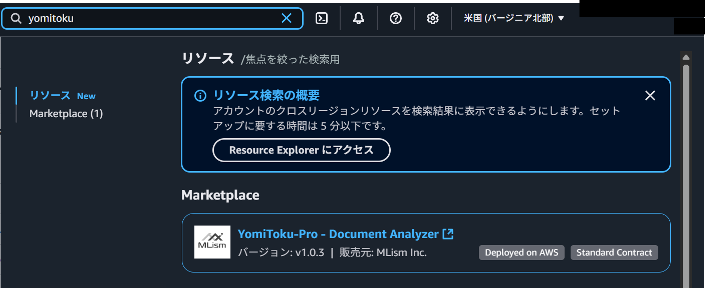
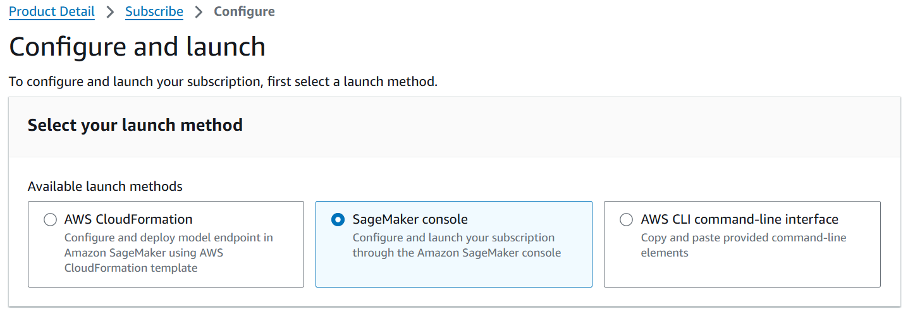

# AWS Marketplaceを用いてデプロイ

## 準備

### AWS IAMユーザーの作成

YomiToku Proを利用するためのAWS IAMユーザーを作成していない場合はIAMユーザーを作成します。IAMユーザーを作成済みの場合はSageMakerへのフルアクセスを許可するロールやポリシーなどがIAMユーザーに付与されているか確認します。

次の手順でIAMユーザーの設定画面を開くことができます。

1. [AWS マネジメントコンソール](https://aws.amazon.com/jp/console/)にサインインします。
1. 左上の検索ウィンドウからIAMを検索します。
1. IAMもしくはIAM Identity Centerを選択します。

## AWS SageMakerでデプロイをする場合

### デプロイ

AWS Marketplaceを用いてAWS SageMakerでデプロイします。
次の流れでデプロイをします。

1. モデルの作成
2. エンドポイントの設定の作成
3. エンドポイントの作成

ここではプロビジョン済みタイプのエンドポイントを使うため、エンドポイントの作成が完了した時点から、エンドポイントを削除するまで料金が発生することに注意です。

1. [AWS マネジメントコンソール](https://aws.amazon.com/jp/console/)にサインインします。
1. 左上の検索ウィンドウからYomiToku Proを検索し、選択します。

1. 右上のContinue to Subscribeを選択し、次のページでも右上のContinue to configurationを選択します。MFA(二段階認証)を強制している設定にも関わらずIAMユーザーのMFAを設定していない場合など、IAMユーザーに権限が無い場合は`AccessDeniedException (省略) with an explicit deny in an identity-based policy`というエラーが生じる事があります。

1. launch methodでSageMaker Consoleを選択します。

1. Software VersionやRegionは使いたいものを選択します。Amazon SageMaker optionsでCreate a real-time inference endpointを選択します。(多数の画像をまとめて処理をしたい場合はCreate a batch transform jobを選択しますが、その場合は説明しません。API呼び出しの方法が変わります。)

1. モデルの設定をします。モデル名を設定し、ロールを設定します。SageMakerからS3へのアクセスできるようなロールを設定します。以下の写真は「新しいロールの作成」を選択した場合の画面です。「ロール作成ウィザードを使用してロールを作成」を選択するとロール名やロールに与える権限をより詳細に設定してロールを作成できます。エンドポイントの作成の2回目以降など、既にロールが存在している場合は新しくロールを作成する必要はありません。

1. コンテナの定義1のコンテナ入力オプションで「AWS Marketplaceからのモデルパッケージサブスクリプションを使用する」を選択します。(デフォルト設定)

1. VPCやタグの設定が必要な場合はします。

1. 右下の「次へ」をクリックしてモデルの作成を完了します。
1. エンドポイント名を設定し、エンドポイント設定のアタッチの項目の選択をします。既存のエンドポイント設定を使用する場合は「既存のエンドポイント設定の使用」を、新しくエンドポイント設定を作成する場合は「新しいエンドポイント設定の作成」を選択します。「既存のエンドポイント設定の使用」を選択した場合は使用するエンドポイント設定を選択して、タグの設定まで移ってください。「新しいエンドポイントの作成」を選択した場合について説明します。

1. エンドポイント名を設定します。エンドポイントのタイプはプロビジョン済みを選択します。暗号化キーは必要な場合は設定します。プロビジョン済みのタイプではエンドポイントを作成してから削除するまでモデルをホストするコンテナが起動し続けます。サーバーレス推論では、API呼び出しが来たときにのみモデルをホストするコンテナが起動し、処理が完了すると終了します。(サーバーレスを選択することもできますが、その場合は説明しません。API呼び出しの方法が変わります。)

1. 非同期呼び出し設定のトグルはオフに設定します。データキャプチャは必要な場合は設定します。(非同期呼び出しの設定をすることもできますが、その場合は説明しません。API呼び出しの方法が変わります。)

1. バリアントは必要な場合は設定します。

1. 「エンドポイント設定の作成」をクリックしてエンドポイント設定の作成を完了します。
1. タグの設定は必要な場合は設定します。
1. 右下の「送信」をクリックしてエンドポイントの作成を完了します。
1. エンドポイントの作成には時間がかかります。
ステータスCreatingがステータスInServiceになるのを待ちます。

### アンデプロイ

次の順番でアンデプロイをします。

1. エンドポイントの削除
1. エンドポイント設定の削除
1. モデルの削除

今後に一度作成したモデルやエンドポイント設定を用いてエンドポイントを作成したい場合はエンドポイント設定の削除やモデルの削除はしません。

1. [AWS マネジメントコンソール](https://aws.amazon.com/jp/console/)にサインインします。
1. 左上の検索ウィンドウからAmazon SageMaker AIを検索します。

1. 左側のメニューをスクロールし、左側のトグルで推論の項目を開きます。

1. 左側のメニューから推論>エンドポイントを開きます。作成したエンドポイント名をクリックします。作成したエンドポイントの設定画面の右上の削除ボタンをクリックします。
1. 左側のメニューから推論>エンドポイント設定を開きます。作成したエンドポイント設定名をクリックします。作成したエンドポイント設定の設定画面の右上の削除ボタンをクリックします。
1. 左側のメニューから推論>モデルを開きます。作成したモデル名をクリックします。作成したモデルの設定画面の右上のアクションボタンをクリックし、削除をクリックします。

### 各種設定の画面

#### ロール

ロールの設定画面はIAMもしくはIAM Identity Centerから開くことができます。ロール名の変更やロールの削除をしたい場合などはそちらをご利用ください。

次の手順でIAMの設定画面を開くことができます。

1. [AWS マネジメントコンソール](https://aws.amazon.com/jp/console/)にサインインします。
1. 左上の検索ウィンドウからIAMを検索します。
1. IAMもしくはIAM Identity Centerを選択します。

1. 左側のメニューでロールを選択します。

#### モデル・エンドポイント設定・エンドポイント

モデル・エンドポイント設定・エンドポイントの設定画面はAmazon SageMaker AIの推論の項目から開くことができます。一度作成したモデルやエンドポイント設定からエンドポイントを作成することや、モデル・エンドポイント設定・エンドポイントの削除などができます。

次の手順でモデル・エンドポイント設定・エンドポイントの設定画面を開くことができます。

1. [AWS マネジメントコンソール](https://aws.amazon.com/jp/console/)にサインインします。
1. 左上の検索ウィンドウからAmazon SageMaker AIを検索します。

1. 左側のメニューをスクロールし、左側のトグルで推論の項目を開きます。

1. 設定したい項目に応じて左側のメニューで推論>モデル、推論>エンドポイント設定、推論>エンドポイントを選択します。

## AWS CloudFormationでデプロイする場合
