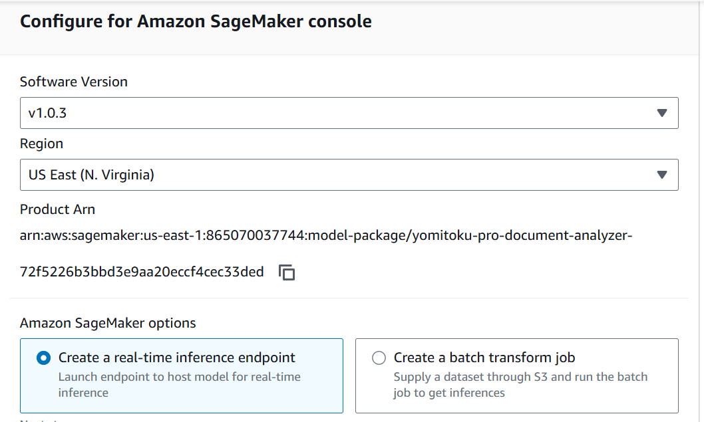
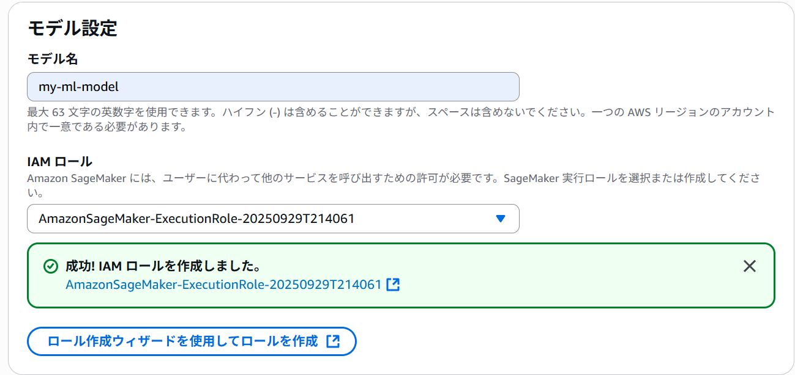
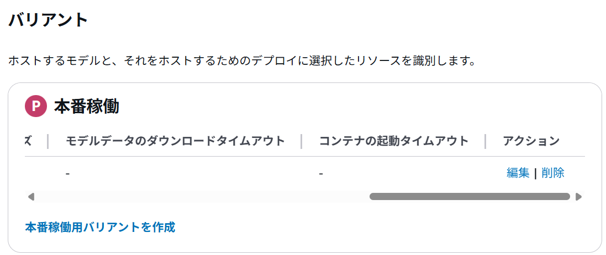
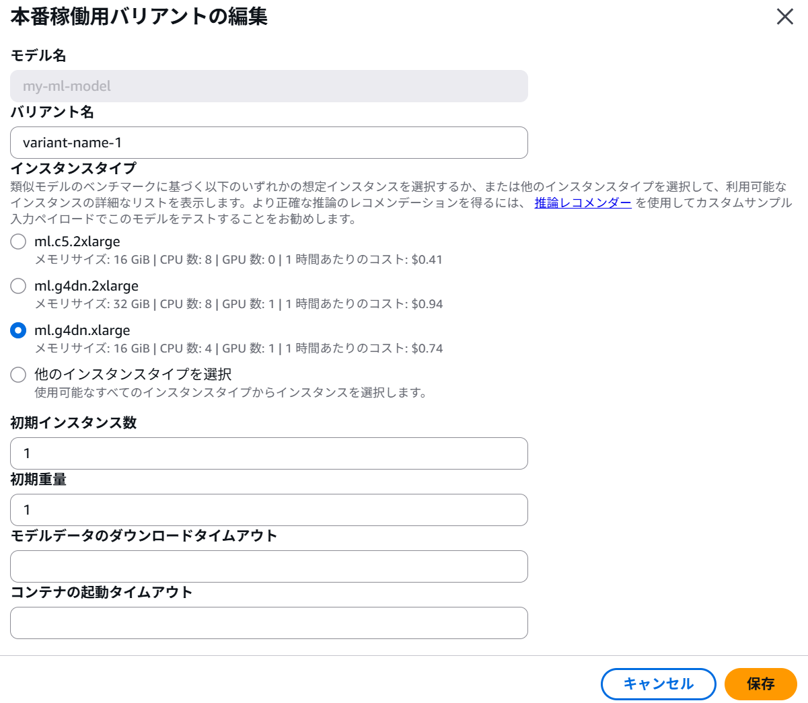
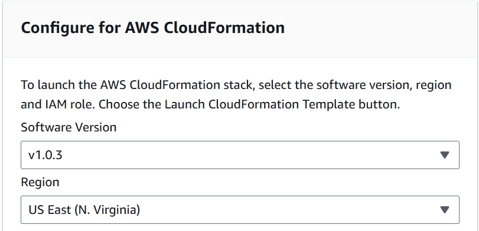
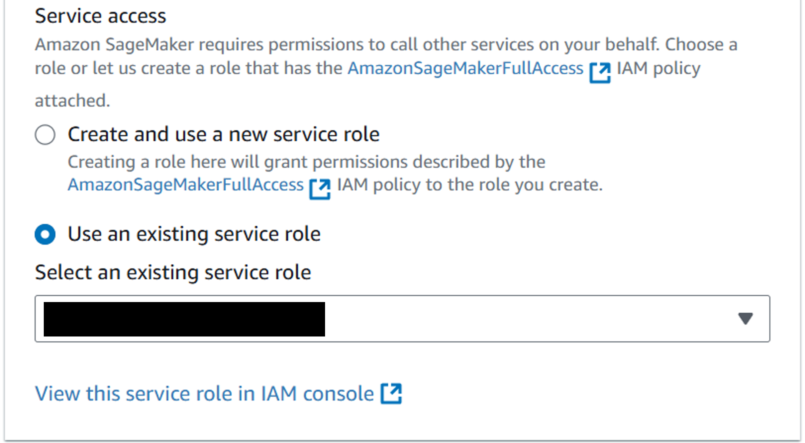
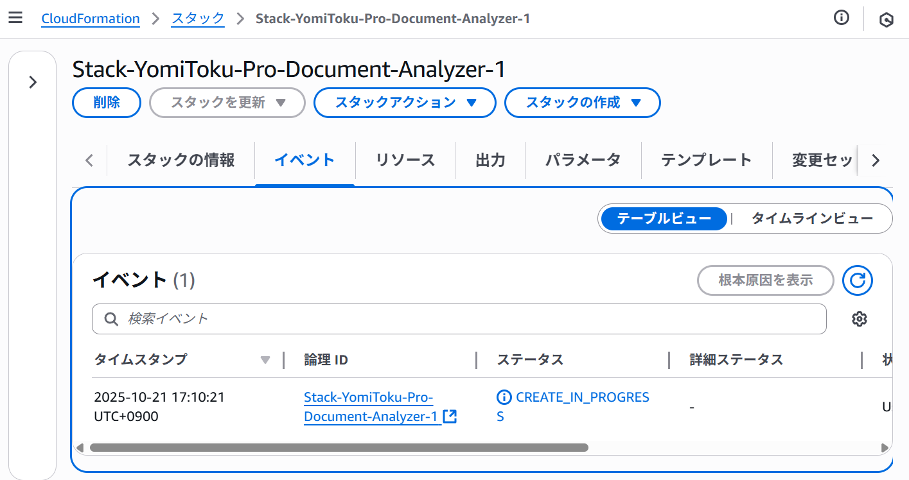
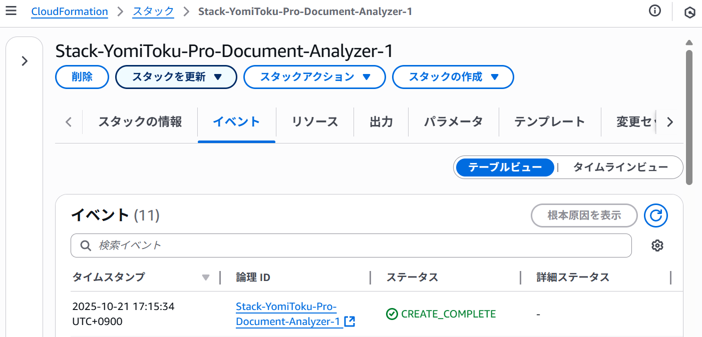
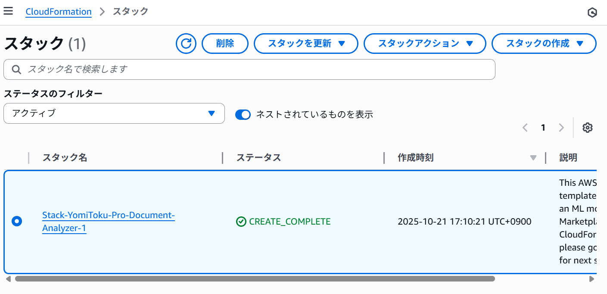

# YomiToku Proのデプロイ

YomiToku ProをAWS Marketplaceを用いてデプロイします。
AWS SageMakerを用いる方法とAWS CloudFormationを用いる方法があります。

AWS CloudFormationではAWS SageMakerのリソースなどをまとめてスタックで管理します。

AWS SageMakerの方が詳細に設定・管理できますが、AWS CloudFormationの方が簡単に設定・管理できます。

## 準備

### IAMの権限確認

Yomitoku Proのデプロイには[AmazonSageMakerFullAccess](https://docs.aws.amazon.com/ja_jp/aws-managed-policy/latest/reference/AmazonSageMakerFullAccess.html)というIAM Policyの権限が必要です。利用するIAMユーザー(もしくはIAMロール)に権限の権限が十分でない場合はそちらの付与をお願いします。

もし以降の手順の中で権限エラーが発生した場合はクラウド管理者にお問い合わせください。

## AWS SageMakerでデプロイをする場合

### AWS SageMakerでデプロイ

AWS Marketplaceを用いてAWS SageMakerでデプロイします。
次の流れでデプロイをします。

1. モデルの作成
2. エンドポイントの設定の作成
3. エンドポイントの作成

ここではプロビジョン済みタイプのエンドポイントを使うため、エンドポイントの作成が完了した時点から、エンドポイントを削除するまで料金が発生します。モデルの作成やエンドポイントの設定を作成しても料金は発生しません。

1. [AWS マネジメントコンソール](https://aws.amazon.com/jp/console/)にサインインします。
1. 左上の検索ウィンドウからYomiToku Proを検索し、選択します。

1. 右上のContinue to Subscribeを選択し、次のページでも右上のContinue to configurationを選択します。

1. launch methodでSageMaker Consoleを選択します。

1. Software Versionは、特別な理由がない限り、最新版を選択します。Regionは、使用するものを選択します。Amazon SageMaker optionsでCreate a real-time inference endpointを選択します。多数の画像をまとめて処理をしたい場合はCreate a batch transform jobを選択しますが、現時点ではYomiToku Clientではサポートされていません。

1. モデルの設定をします。モデル名を設定し、ロールを設定します。「新しいロールの作成」を選択した際に自動作成されるロールを利用することを推奨します。「ロール作成ウィザードを使用してロールを作成」を選択するとロール名やロールに与える権限をより詳細に設定してロールを作成できます。エンドポイントの作成の2回目以降など、既にロールが存在している場合は新しくロールを作成する必要はありません。ロールの削除がしたいなどの理由でロールの設定画面を開きたい場合は本ドキュメントの「付録:各種設定画面の開き方」をご確認ください。

1. コンテナの定義1のコンテナ入力オプションで「AWS Marketplaceからのモデルパッケージサブスクリプションを使用する」を選択します。（デフォルト設定）

1. VPCはAWS上に構築する仮想的なプライベートネットワークです。AWS上の他のサービスから接続する際にVPCを用いることでセキュアな通信経路を構築できます。VPCの設定は必要に応じて設定します。（VPCの設定は必須ではありません。）詳しくは[こちらの公式ドキュメント](https://docs.aws.amazon.com/ja_jp/sagemaker/latest/dg/host-vpc.html)をご確認ください。タグは、AWSリソースに設定するキーと値のペアです。リソースの識別、分類、管理を目的として、必要に応じて設定します。詳しくは[こちらの公式ドキュメント](https://docs.aws.amazon.com/ja_jp/whitepapers/latest/tagging-best-practices/what-are-tags.html)をご確認ください。

1. 右下の「次へ」をクリックしてモデルの作成を完了します。
1. エンドポイント名を設定し、エンドポイント設定のアタッチの項目の選択をします。既存のエンドポイント設定を使用する場合は「既存のエンドポイント設定の使用」を、新しくエンドポイント設定を作成する場合は「新しいエンドポイント設定の作成」を選択します。「既存のエンドポイント設定の使用」を選択した場合は使用するエンドポイント設定を選択して、バリアントの設定まで移ってください。「新しいエンドポイントの作成」を選択した場合について説明します。

1. エンドポイント設定名を設定します。エンドポイントのタイプはプロビジョン済みを選択します。暗号化キーを設定することでSageMakerがS3にデータを保存する際に用いられるAWS KMSキーを、お客様が管理・指定できます。暗号化キーは適宜設定します。（暗号化キーの設定は必須ではありません。）暗号化キーについては詳しくは[こちらの公式ドキュメント](https://docs.aws.amazon.com/ja_jp/sagemaker/latest/dg/encryption-at-rest.html)をご確認ください。プロビジョン済みのタイプではエンドポイントを作成してから削除するまでモデルをホストするコンテナが起動し続けます。サーバーレス推論はGPUをサポートしていないのでYomiToku Proでサポートされていません。

1. 非同期呼び出し設定のトグルとデータキャプチャのトグルはオフに設定します。非同期呼び出し設定は現時点ではYomiToku Proでサポートされていません。データキャプチャはここでは利用しません。

1. インスタンスタイプやインスタンス数などを変更する際はバリアントの設定をします。インスタンスタイプによってインスタンスの性能とコストが変わります。本番稼働の下にあるスクロールバーを右にスクロールします。

アクションの欄にある「編集」をクリックします。

インスタンスタイプを選択します。検証の場合はml.g4dn.xlargeで十分ですが、性能を求める場合はml.g5.xlargeを選択します。ml.c5.2xlargeではGPUを使うことができないのでYomiToku Proでサポートされていません。初期インスタンス数を設定します。インスタンス数に応じて同時に処理できるリクエストの数が増えますが、コストもインスタンス数に比例して増加します。その他の設定はここでは利用しません。

1. 右下の「保存」をクリックしてバリアントの設定を保存します。
1. シャドウバリアントの設定はここでは利用しません。
1. 「エンドポイント設定の作成」をクリックしてエンドポイント設定の作成を完了します。
1. タグの設定は必要な場合は設定します。
1. 右下の「送信」をクリックしてエンドポイントの作成を完了します。
1. エンドポイントの作成には時間がかかります。
ステータスCreatingがステータスInServiceになるのを待ちます。

### AWS SageMakerでアンデプロイ

次の順番でアンデプロイをします。

1. エンドポイントの削除
1. エンドポイント設定の削除
1. モデルの削除

同じモデルやエンドポイント設定でエンドポイントをデプロイしたい場合はモデルやエンドポイント設定を削除する必要はありません。これらの情報を保持しても料金は発生しませんが、デプロイされたエンドポイントは削除が完了するまで料金が発生し続けます。

1. [AWS マネジメントコンソール](https://aws.amazon.com/jp/console/)にサインインします。
1. 左上の検索ウィンドウからAmazon SageMaker AIを検索します。

1. 左側のメニューをスクロールし、左側のトグルで推論の項目を開きます。

1. 左側のメニューから推論>エンドポイントを開きます。作成したエンドポイント名をクリックします。作成したエンドポイントの設定画面の右上の削除ボタンをクリックします。
1. 左側のメニューから推論>エンドポイント設定を開きます。作成したエンドポイント設定名をクリックします。作成したエンドポイント設定の設定画面の右上の削除ボタンをクリックします。
1. 左側のメニューから推論>モデルを開きます。作成したモデル名をクリックします。作成したモデルの設定画面の右上のアクションボタンをクリックし、削除をクリックします。

既存のモデルやエンドポイント設定からエンドポイントを作成する際は、それぞれの設定画面（モデル設定画面、エンドポイント設定画面など）を開いて操作します。

## AWS CloudFormationでデプロイする場合

CloudFormationでは、AWSリソースのセット全体をスタックという単位で一元管理します。
スタックには、AWS SageMakerのモデル・エンドポイント設定・エンドポイントのリソースなどが含まれています。
デプロイの際はスタックを作成し、アンデプロイの際はスタックを削除します。
スタックが作成されてからスタックが削除されるまで料金が発生し続けます。

### AWS CloudFormationでデプロイ

1. [AWS マネジメントコンソール](https://aws.amazon.com/jp/console/)にサインインします。
1. 左上の検索ウィンドウからYomiToku Proを検索し、選択します。

1. 右上のContinue to Subscribeを選択し、次のページでも右上のContinue to configurationを選択します。

1. launch methodでAWS CloudFormationを選択します。

1.Software Versionは、特別な理由がない限り、最新版を選択します。Regionは、使用するものを選択します。

1.YomiToku Proの2回目以降のデプロイの場合など、既にロールが存在している場合は「Use an existing service role」を選択し、そのロールを選択します。初めての場合は「Create and use a new service role」を選択します。AmazonSagemaker-ExecutionRoleから始まる名前のロールが作成されます。CloudFormationのスタック内で既存のS3バケットを利用（参照）したい場合や、その設定をスタックで管理したい場合には、バケット名を指定します。

1.スタック名を設定します。

1.エンドポイント名、インスタンス数、インスタンスタイプを設定します。インスタンス数に応じて同時に処理できるリクエストの数が増えますが、コストもインスタンス数に比例して増加します。インスタンスタイプは検証の場合はml.g4dn.xlargeで十分ですが、性能を求める場合はml.g5.xlargeを入力します。その他の項目については変更しません。

1.タグは、AWSリソースに設定するキーと値のペアです。リソースの識別、分類、管理を目的として、必要に応じて設定します。詳しくは[こちらの公式ドキュメント](https://docs.aws.amazon.com/ja_jp/whitepapers/latest/tagging-best-practices/what-are-tags.html)をご確認ください。

1. アクセス許可を必要に応じて設定します。デフォルトではユーザーの権限で実行されますが、IAMロールを指定してCloudFormationを実行したい場合は設定します。

1. 「その他の設定」については特に理由が無ければデフォルト設定で構いません。詳細については[こちらのドキュメント](https://docs.aws.amazon.com/AWSCloudFormation/latest/UserGuide/cfn-console-create-stack.html?icmpid=docs_cfn_console#configure-stack-options)をご確認ください。
1. 右下の「スタックの作成」を選択します。
1. スタックの作成には時間がかかります。作成したスタックのステータスがCREATE_IN_PROGRESSからCREATE_COMPLETEになるまで待ちます。論理IDがスタック名、ステータスがCREATE_COMPLETEのイベントが発生したかどうかなどでスタックの作成が完了したかどうかを確認することができます。

### AWS CloudFormationでアンデプロイ

1. [AWS マネジメントコンソール](https://aws.amazon.com/jp/console/)にサインインします。
1. 左上の検索ウィンドウからCloudFormationを検索します。

1. デプロイしたスタック名の左側の円形のチェックボックスを選択します。

1. 上部にある「削除」を選択します。

## 付録:各種設定画面の開き方

### ロール

ロールの設定画面はIAMから開くことができます。ロールの削除をしたい場合などはそちらをご利用ください。

次の手順でIAMの設定画面を開くことができます。

1. [AWS マネジメントコンソール](https://aws.amazon.com/jp/console/)にサインインします。
1. 左上の検索ウィンドウからIAMを検索します。
1. IAMを選択します。

1. 左側のメニューでロールを選択します。

### AWS SageMakerのモデル・エンドポイント設定・エンドポイント

AWS SageMakerのモデル・エンドポイント設定・エンドポイントの設定画面はAmazon SageMaker AIの推論の項目から開くことができます。一度作成したモデルやエンドポイント設定からエンドポイントを作成することや、モデル・エンドポイント設定・エンドポイントの削除などができます。

次の手順でモデル・エンドポイント設定・エンドポイントの設定画面を開くことができます。

1. [AWS マネジメントコンソール](https://aws.amazon.com/jp/console/)にサインインします。
1. 左上の検索ウィンドウからAmazon SageMaker AIを検索します。

1. 左側のメニューをスクロールし、左側のトグルで推論の項目を開きます。

1. 設定したい項目に応じて左側のメニューで推論>モデル、推論>エンドポイント設定、推論>エンドポイントを選択します。

### AWS CloudFormationのスタック

AWS CloudFormationのスタックの設定画面はCloudFormationを検索すると開くことができます。

1. [AWS マネジメントコンソール](https://aws.amazon.com/jp/console/)にサインインします。
1. 左上の検索ウィンドウからCloudFormationを検索します。

1. CloudFormationを選択すると、スタックの設定画面が開くことができます。
